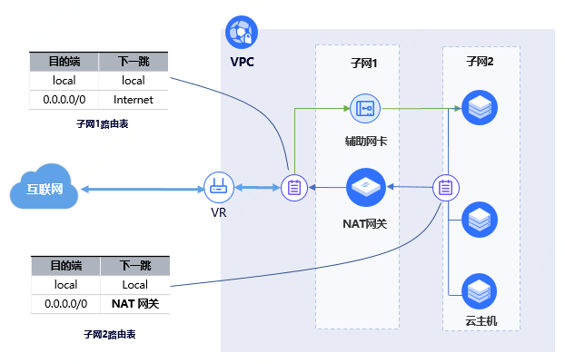
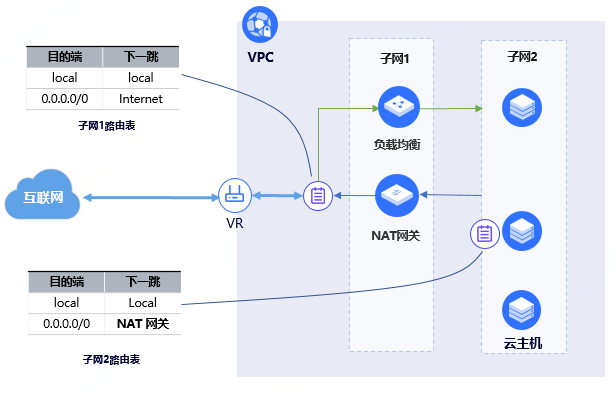

# 配置SNAT功能的云主机对外提供Telent、SSH等服务

NAT网关可以为VPC内云主机提供SNAT功能，即为VPC内无公网IP的云主机提供访问互联网的代理服务。如果VPC内某些云主机仍需对外提供Telnet、SSH等服务，您可根据不同场景选择如下两种配置方式：

- [绑定辅助网卡方式](Config-LB-ENI-Nat-Gateway#user-content-1)：如配置SNAT功能的VPC内网云主机仍需通过Telnet、SSH等方式登录云主机进行其他配置，可为云主机绑定辅助网卡，您通过Telnet、SSH辅助网卡的公网IP登录云主机；

- [配置负载均衡方式](Config-LB-ENI-Nat-Gateway#user-content-2)：如配置SNAT功能的VPC内云主机仍需对外提供高可用服务，可将多台云主机绑定负载均衡，您通过负载均衡的公网IP访问云主机服务。

## 绑定辅助网卡方式

### 配置说明
1. 创建NAT网关、配置NAT网关所在子网绑定路由表路由（目的地址0.0.0.0/0，下一跳为Internet）、配置VPC内云主机所在子网绑定路由表路由（目的地址0.0.0.0/0，下一跳为NAT网关）。NAT网关与VPC内云主机必须属于不同子网，可参照步骤[云主机使用NAT网关](../Getting-Started/Create-NatGateway.md)。

2. 在【网络-私有网络-弹性网卡】页面创建弹性辅助网卡，辅助网卡与NAT网关部署在同一个外部子网，并为辅助网卡的内网IP绑定公网IP。

3. 进入【弹性计算-云主机】页面，点击云主机详情，在【弹性网卡】页签为云主机绑定上一步骤创建的辅助网卡。

4. 登录云主机，配置路由使辅助网卡在云主机内生效，可参照步骤[云主机内配置路由使辅助网卡生效](https://docs.jdcloud.com/cn/elastic-network-interface/linux-permanent-configuration)。
 
  组网图如下：

### 验证及流量转发说明
1. 验证VPC内云主机通过主网卡可正常访问互联网，云主机主动访问互联网的流量转发路径为“ 云主机主网卡 ↔ NAT网关 ↔ VR ↔ Internet ”。

2. 验证Telnet/SSH云主机辅助网卡可正常登录云主机，访问辅助网卡的流量转发路径为“ Internet ↔ VR ↔ 云主机辅助网卡 ”。

## 配置负载均衡方式

### 配置说明
1. 创建NAT网关、配置NAT网关所在子网绑定路由表路由（目的地址0.0.0.0/0，下一跳为Internet）、配置VPC内云主机所在子网绑定路由表路由（目的地址0.0.0.0/0，下一跳为NAT网关）。NAT网关与VPC内云主机必须属于不同子网，可参照步骤[云主机使用NAT网关](../Getting-Started/Create-NatGateway.md)。

2. 在【网络-负载均衡】页面创建外网负载均衡，负载均衡与NAT网关部署在同一个外部子网，配置负载均衡的监听器、后端服务、虚拟服务器组，并将VPC内云主机添加到虚拟服务器组。负载均衡的类型选择及配置步骤可参见负载均衡产品文档。

 组网图如下：

### 验证及流量转发说明
1. 验证VPC内云主机可正常访问互联网，云主机访问互联网的流量转发路径为“ 云主机 ↔ NAT网关 ↔ VR ↔ Internet ”。

2. 验证访问负载均衡公网IP流量可正常分发到VPC内云主机，访问负载均衡公网IP的流量转发路径为“ Internet ↔ VR ↔ 负载均衡 ↔ 云主机”。
