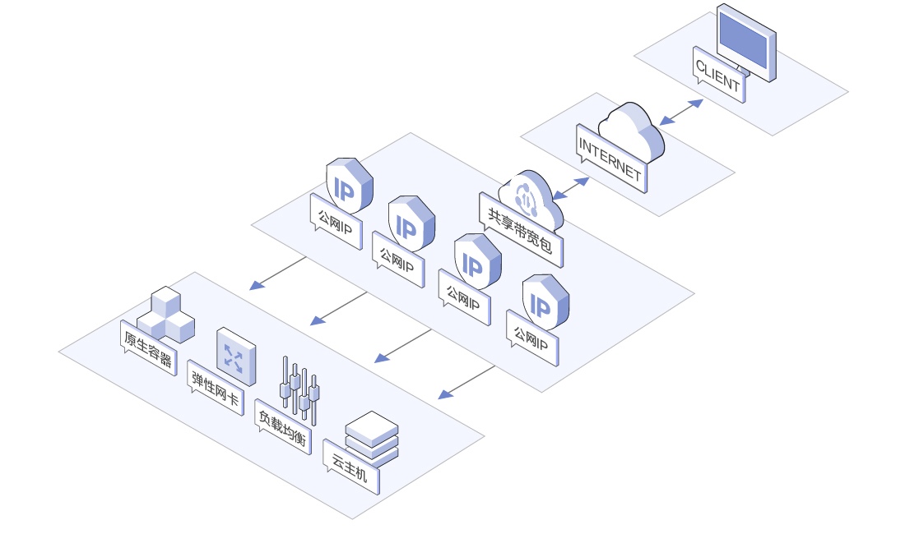
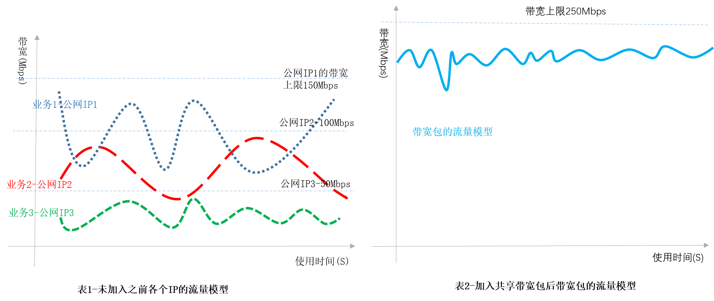
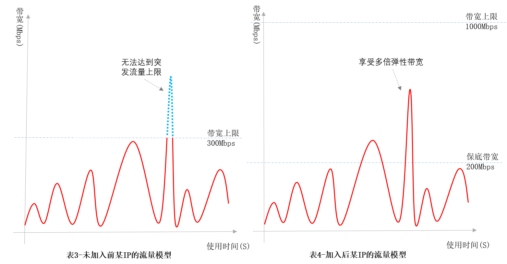

# 应用场景

### 业务多——统一管理

随着业务增长，大量的业务需要布置在云上，每个云主机、容器等实例访问公网或被公网访问均需要购买一条带宽，利用共享带宽包不仅只需要购买一条带宽，且可将同一个项目中的公网IP资源加入一个共享带宽包实现根据业务对资源进行分组管理，如下图所示。

 

当您拥有多个公网IP时，需要购买多条带宽如下图表1所示，IP流量模型不尽相同，波峰波谷差距明显，在波谷时段带宽使用率低。若加入共享带宽包，如表2所示，充分利用错峰波谷时段带宽，波峰波谷差距更加扁平，提升带宽的使用率的同时降低带宽成本。

 

+ **统一计费**

公网IP加入共享带宽包后，原有的计费方式失效（移除后恢复原有的计费规则），统一通过共享带宽包进行计费。

+ **统一限速**

公网IP加入共享带宽包后带宽上限默认为共享带宽包的带宽上限，原有的带宽上限失效（移除后恢复原有带宽上限），共享带宽包对多IP统一限速，多IP复用共享一条带宽，只需维护一条带宽，降低运维成本。且共享带宽包支持对公网IP进行单独限速。

+ **统一监控**

支持对共享带宽包带宽数据进行监控，监控数据为加入该共享带宽包的所有公网IP的实时带宽数据总和，共享带宽包中单IP的监控数据可在对应的公网IP详情页查看。

### 业务突发流量——消峰计费提供多倍弹性峰值带宽

共享带宽包支持消峰计费，可**支持短时间内流量突发式增长业务，享受多倍弹性峰值**，短时间的突发流量费用通过消峰后不计入带宽费用，**只需支付少量的带宽费用即可满足业务需求**，降低带宽成本。如电商促销活动、限时秒杀等业务，在突发流量外，其余时间整体带宽速率较低，具体流量模型如下表3所示，当绝大部分时间带宽较低时，难以及时调整带宽满足突发流量需求，此时会影响到突发流量业务的正常运行。如果购买较大带宽，将会增加带宽成本，若加入按消峰计费的共享带宽包，如表4所示，即可在节省带宽成本的同时满足业务需求。

 

## 相关参考
- [共享带宽包概述](Product-Overview.md)
- [产品优势](Benefits.md)
- [计费概述](../Pricing/Billing-Overview.md)
- [计费规则](../Pricing/Billed-Rules.md)
- [价格总览](../Pricing/Price-Overview.md)
- [增强95消峰计费](../Pricing/Charge-By-Usage/Enhance95th-Eliminate.md)
- [查看共享带宽包监控信息](../Operation-Guide/View-Monitoring.md)
- [创建共享带宽包](../Operation-Guide/Create-Bwp.md)
- [修改共享带宽包](../Operation-Guide/Modify-Bwp.md)
- [删除共享带宽包](../Operation-Guide/Delete-Bwp.md)
- [管理公网IP](../Getting-Started/Manage-Public-IP.md)
