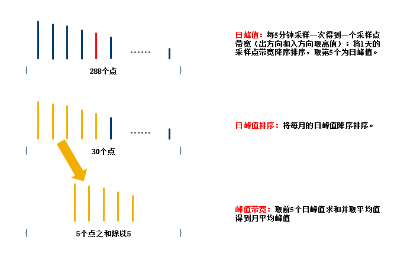

# 计费规则
共享带宽包计费类型支持以下三种类型：
- [包年包月](instance-type-family#user-content-1)
- [按配置计费](instance-type-family#user-content-2)
- [增强95消峰计费](instance-type-family#user-content-3)

## 包年包月
<div id="user-content-1"></div>

#### 详细介绍

- 包年包月为预付费方式，一次性支付一个月、多个月或多年的费用。

- 提前支付数月或数年的费用，目前购买时间段支持1个月~11个月、1年，一次购买1年打8.3折，费用在您创建资源时一次性扣除；

- 包年包月的资源在到期前不支持执行删除操作，为了保障您的使用权益，请确认业务需求后进行购买。

- 包年包月计费订单的到期时间为订单开始时间当日起向后第N个自然月或自然年的 23:59:59； 例如：订单的开始时间为2016年1月1日 15:00:00，购买时长为1个月，则到期时间为2016年月2日1日 23:59:59。


#### 计费公式

包年包月共享带宽实例的总费用 = 带宽单价（元/月/Mbps） x 带宽上限（Mbps） x 购买时长（月）


#### 变配计费规则

- 升配：提升共享带宽包的带宽上限，执行升配时，系统会根据已购买共享带宽包的剩余使用时长自动计算升配后所需补缴的差价，生成订单，共享带宽包的到期时间不变。

- 降配：降低共享带宽包的带宽上限，执行降配时，系统会根据已购买共享带宽包的剩余使用时长自动计算延长到期时间，生成订单，无需付款。

## 按配置计费
<div id="user-content-2"></div>

#### 详细介绍

按配置计费为后付费方式，计费周期为1小时，根据您购买的共享带宽包配置情况，以及计费周期内的实际使用时长（精确到秒），在每整点计算前一周期的费用并扣费。用户余额低于50元时不支持创建按配置计费的共享带宽包，充值后可创建。


#### 计费公式

带宽总费用=带宽单价(元/小时/Mbps) * 使用时长(小时) *带宽上限(Mbps)
```
说明：带宽上限为计费周期带宽上限的最大值
```

#### 变配计费规则

- 支持升配或降配，调整配置后立即生效

- 执行升配或者降配操作后，账单费用根据计费周期的最大带宽上限进行计费


## 增强95消峰计费
<div id="user-content-3"></div>

#### 详细介绍

- 按增强95消峰计费每天收取保底带宽费用，并每天根据共享带宽包实际使用流量出账单；

- 目前保底带宽按照购买带宽上限的20%设定（保底带宽单价和超保底带宽单价相同）；

- 选择按增强95消峰计费模式至少需要使用一个完整的自然月，最早支持在下个月出完账单之后删除。

#### 计费公式

- 月度费用 = 保底带宽费用 + 超保底带宽费用。


#### 保底带宽费用

- 保底带宽费用 = 保底带宽1 × 实例对应保底带宽存在天数1x 增强95保底带宽日单价1 + 保底带宽2 × 实例对应保底带宽存在天数2x 增强95保底带宽日单价2 + ...+ 保底带宽n × 实例对应保底带宽存在天数nx 增强95保底带宽日单价n

```
说明：一个月中共享带宽包经过变配操作，存在不同的共享带宽上限，进而存在不同的保底带宽1、保底带宽2、...、保底带宽n
```

- 月平均保底带宽 = 保底带宽费用 ÷ 实例对应计费周期存在天数

- 若月平均超保底带宽大于0，则收取超保底带宽费用。


#### 超保底带宽费用

- 月平均超保底带宽 = MAX（0,(月平均峰值 – 月平均保底带宽））

- 超保底带宽费用 = 月平均超保底带宽 × 增强95超保底带宽日单价 × 实例对应计费周期存在天数


#### 月平均峰值

月平均峰值带宽计算方法如下：

- 日峰值：以5分钟为粒度采样，采集入方向和出方向的流量，分别计算入方向和出方向在5分钟内的带宽平均值，取入方向和出方向中较大的带宽平均值作为采样点带宽值。每天得到全部采样点后，按从高到低排序，去掉前4个最高的采样点，取第5峰采样点为日峰值（ 如果当天采样点不足5个，以排序后的最后一个为日峰值）。

- 月平均峰值：月底将日峰值从高到底排序，取前5个最高的日峰值，计算其均值得到月平均峰值。

下图为1个完整自然月Top5峰值计费采样和计算方法说明。


 

#### 变配计费规则

- 按用量计费模式支持实时调节共享带宽上限，并立刻生效。调整完共享带宽上限后，保底带宽也会随之变化；

- 按用量计费模式的共享带宽包不支持调整保底带宽百分比。目前仅支持的百分比为20%；

- 升配/降配 ：以天为粒度计算，每天的保底带宽为当天设置过的最大保底带宽；例如：一天中进行过带宽上限调整: 1000Mbit/s -> 3000Mbit/s -> 2000Mbit/s，则当天的保底带宽为3000Mbit/s\*20%=600Mbit/s；

- 实例对应计费周期存在天数：计费周期时间（单位：秒）/（24\*60\*60），实例存在天数小数部分取小数点后2位，其他小数位直接舍弃。


#### 账单说明

- 账单周期：保底带宽费用及超保底带宽费用按月出账单，可提供精确到天的费用明细；

- 出账时间：通常为当前计费周期结束的下个自然月1日。例如：3月1日会生成2月份完整月（2020-02-01 00:00:00 至 2020-02-29 23:59:59）的超保底带宽计费账单；

- 结算时间：账单生成后会自动从您的账户余额中扣除费用以结算账单。请确保结算时账户的余额充足，以免出现欠费问题。

注意：增强95消峰计费实际使用天数和共享带宽中是否有业务流量无关，如果创建后不使用的时间也会被计算成实际使用天数。
