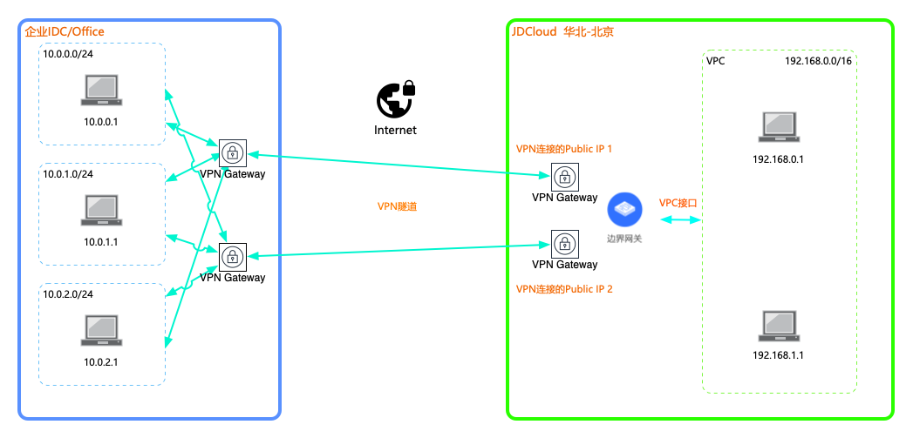

## VPN高可用方案
本教程将为您介绍如何通过云IPsec VPN，建立企业IDC到公有云VPC之间高可用的私有连接。

### 业务场景
客户将核心/非适宜上云的业务部署在自建IDC内，非核心业务/扩展业务部署在云VPC内，需要打通IDC和公有云VPC的网络环境，实现内网通信，同时保证业务的高可用。<br />


### 前置条件
* 企业IDC内的网段与公有云VPC内的网段不能重叠。
* VPN连接运行BGP路由协议。

对客户端设备的要求，详见[使用限制](../Introduction/Restrictions.md)。

### 详细步骤
###### 步骤1.创建边界网关

a)登录[边界网关控制台](https://cns-console.jdcloud.com/host/borderGateway/list)；  <br />
b)选择使用VPN的地域，点击创建边界网关；<br />
c)边界网关支持运行BGP路由协议，当前云边界网关的BGP ASN固定为65000，后续会开放修改；<br />

更多内容，详见[边界网关管理](../Operation-Guide/Border-Gateway-Management/Border-Gateway-Configuration.md)。

###### 步骤2.创建VPC接口
a)登录[VPC接口控制台](https://cns-console.jdcloud.com/host/vpcAttachment/list)；  <br />
b)选择使用VPN的地域，点击创建VPC接口；<br />
c)选择步骤1中创建的边界网关，选择要通过该边界网关路由流量的VPC，选择要传播到该边界网关中的VPC网段，创建VPC接口后，被选择的网段将自动添加到该边界网关的传播路由表中，下一跳指向此步骤创建的VPC接口；<br />

更多内容，详见[VPC接口管理](../Operation-Guide/Border-Gateway-Management/VPC-Attachment-Configuration.md)。

###### 步骤3.创建客户网关
a)登录[客户网关控制台](https://cns-console.jdcloud.com/host/customerGateway/list)；  <br />
b)选择使用VPN的地域，点击创建客户网关；<br />
c)客户网关是客户端VPN设备在云端的逻辑表示，客户将基于边界网关和客户网关创建VPN连接。客户网关本身仅代表客户端设备的相关信息(``只涉及公网地址和BGP ASN，无具体地理位置的概念``)，理论上并没有地域的属性，但由于云内资源几乎都有地域的属性，故也为客户网关分配了地域属性。相同配置的客户网关可以在不同地域重复创建，互不影响。<br />
d)若客户端设备支持BGP路由协议，请指定客户端的BGP ASN；<br />
e)客户端支持配置多个公网地址，基于业务高可用的考虑，选择客户端双IP，创建客户网关；<br />

更多内容，详见[客户网关管理](../Operation-Guide/Customer-Gateway-Management/Customer-Gateway-Configuration.md)。

###### 步骤4.创建VPN连接
a)登录[VPN连接控制台](https://cns-console.jdcloud.com/host/vpnConnection/list)；  <br />
b)选择使用VPN的地域，点击创建VPN连接；<br />
c)选择用于实现云端VPN网关功能的边界网关；<br />
d)选择表示客户端VPN设备的客户网关；<br />
e)选择连接类型，当前仅支持隧道内外层地址均为IPv4地址簇，未来会支持IPv6地址簇；<br />
f)选择是否启用BGP路由，基于业务高可用的考虑，默认启用BGP路由，此时将基于边界网关和客户网关建立BGP会话；<br />
g)创建VPN连接后，会自动分配两个云端公网地址，用于和客户端公网地址间建立VPN隧道；<br />

更多内容，详见[VPN连接管理](../Operation-Guide/VPN-Connection-Management/VPN-Connection-Configuration.md)。

###### 步骤5.创建VPN隧道
a)登录[VPN连接控制台](https://cns-console.jdcloud.com/host/vpnConnection/list)；  <br />
b)选择使用VPN的地域，选择VPN连接；<br />
c)点击“资源信息”Tab中的“添加隧道”，自动初始化两条隧道的创建页面，一条隧道的两端IP分别是VPN连接的云端IP中的一个，以及客户网关公网地址中的一个，另一条隧道的两端IP是云端IP的另外一个和客户网关公网地址中的另外一个； <br />
e)为每个隧道分别配置两阶段协商所使用的参数，包括IKE版本、预共享密钥、隧道两端网关标识、隧道内层IP(用于隧道内路由数据包)，以及两阶段的认证算法、加密算法、SA声明周期等；<br />

```
基于安全性和性能的综合考虑，给出了默认的隧道IKE和IPsec推荐配置，建议客户按推荐配置协商建立VPN隧道。
```

更多内容，详见[VPN隧道管理](../Operation-Guide/VPN-Connection-Management/VPN-Tunnel-Configuration.md)。

###### 步骤6.配置VPN客户端
a)当前[VPN连接控制台](https://cns-console.jdcloud.com/host/vpnConnection/list)尚不提供VPN隧道客户端配置下载功能；<br />
b)已测试支持的客户端路由器/防火墙设备列表，详见[使用限制](../Introduction/Restrictions.md)，相同厂商的不同平台、软件版本间的VPN配置项差异性基本不大，可按相同系列已通过测试的客户端推荐配置进行设置，若有问题，请咨询您的设备提供商；<br />
c)未在b中列出的设备厂商型号，可参考设备厂商给出的配置手册进行标准的IPsec配置；<br />
d)``完成客户端VPN设备配置后，云端默认会主动发起协商建立隧道``，此时可在[VPN连接控制台](https://cns-console.jdcloud.com/host/vpnConnection/list)中查看隧道的运行状态是否更新为“UP”，若为“UP”，则表示隧道协商成功，若为“DOWN”，请参考[FAQ](../FAQ/FAQ.md)进行故障处理；<br />

更多内容，详见[VPN客户端管理](../Operation-Guide/Client-Site-Configuration/Cisco-Configuration.md)。

###### 步骤7.配置BGP
a)京东智联云支持与VPN客户端设备之间运行EBGP路由协议，客户端设备需使用与云边界网关不同的BGP ASN，京东智联云使用的BGP ASN见[边界网关的ASN](../Operation-Guide/Border-Gateway-Management/Border-Gateway-Configuration.md)；<br />
b)建立BGP使用的互联地址为隧道的内层地址，详见[VPN隧道管理](../Operation-Guide/VPN-Connection-Management/VPN-Tunnel-Configuration.md)；<br />
c)云端BGP的其它配置使用默认配置，可在客户端设备上进行修改；<br />

###### 步骤8.配置路由
a)京东智联云VPN连接支持在云端和客户端之间使用BGP动态路由；<br />
b)配置边界网关路由表和VPC路由表的路由传播；<br />

有关路由传播的更多内容，详见[配置边界网关路由](../Operation-Guide/Route-Management/Border-Gateway-Route-Configuration.md)和[配置VPC路由](../Operation-Guide/Route-Management/VPC-Route-Configuration.md)。

###### 步骤9.测试连通性并验证路由切换
a)登录[云主机控制台](https://cns-console.jdcloud.com/host/compute/list)，在创建了服务的地域下，要和企业IDC内网网段互通的VPC中创建一台云主机，确认该云主机所在子网的路由表中存在正确去往企业IDC内网网段的路由；  <br />
b)使用a中创建的云主机ping企业IDC内网中的一台实例的内网地址，验证内网通信是否正常；<br />
c)在客户端路由器上将其中一条VPN隧道的BGP会话断开，或将其路由摘除,或将其路由的端口置DOWN，查看流量是否切换到另一条VPN隧道上，验证有效后，再将第一条VPN隧道及路由建立起来；<br />
