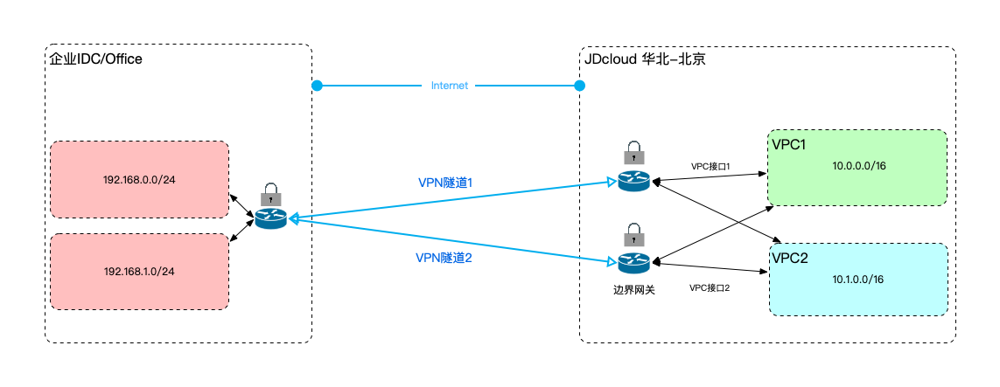

## 企业IDC连接公有云
本教程将为您介绍如何通过云IPsec VPN，建立企业IDC到公有云VPC的私有连接。

### 业务场景
客户将核心/非适宜上云的业务部署在自建IDC内，非核心业务/扩展业务部署在云VPC内，需要打通IDC和公有云VPC的网络环境，实现内网通信。<br />


### 前置条件
企业IDC内的网段与公有云VPC内的网段不能重叠。
对客户端设备的要求，详见[使用限制](../Introduction/Restrictions.md)。

### 配置步骤


### 详细步骤
###### 步骤1.创建边界网关

a)登录[边界网关控制台](https://cns-console.jdcloud.com/host/borderGateway/list)；  <br />
b)选择使用VPN的地域，点击创建边界网关；<br />
c)边界网关支持运行BGP路由协议，当前京东智联云边界网关的BGP ASN固定为65000，后续会开放修改；<br />
更多内容，详见[边界网关管理](../Operation-Guide/Border-Gateway-Management/Border-Gateway-Configuration.md)。

###### 步骤2.创建VPC接口
a)登录[VPC接口控制台](https://cns-console.jdcloud.com/host/vpcAttachment/list)；  <br />
b)选择使用VPN的地域，点击创建VPC接口；<br />
c)选择步骤1中创建的边界网关，选择要通过该边界网关路由流量的VPC，选择要传播到该边界网关中的VPC网段，创建VPC接口后，被选择的网段将自动添加到该边界网关的传播路由表中，下一跳指向此步骤创建的VPC接口；<br />

更多内容，详见[VPC接口管理](../Operation-Guide/Border-Gateway-Management/VPC-Attachment-Configuration.md)。

###### 步骤3.创建客户网关
a)登录[客户网关控制台](https://cns-console.jdcloud.com/host/customerGateway/list)；  <br />
b)选择使用VPN的地域，点击创建客户网关；<br />
c)客户网关是客户端VPN设备在云端的逻辑表示，客户将基于边界网关和客户网关创建VPN连接。客户网关本身仅代表客户端设备的相关信息(``只涉及公网地址和BGP ASN，无具体地理位置的概念``)，理论上并没有地域的属性，但由于云内资源几乎都有地域的属性，故也为客户网关分配了地域属性。相同配置的客户网关可以在不同地域重复创建，互不影响。<br />
d)若客户端设备支持BGP路由协议，请指定客户端的BGP ASN；<br />
e)客户端支持配置多个公网地址，基于业务高可用的考虑，默认选中客户端双IP的选项，同时支持客户端单IP和客户端四IP的选项，其中客户端单IP适用于大多数VPN互联场景，客户端四IP适用于和Amazon AWS之间建立VPN连接，具体配置方式详见[连接到亚马逊AWS](../Best-Practices/Connection-Into-Amazon.md)；<br />

更多内容，详见[客户网关管理](../Operation-Guide/Customer-Gateway-Management/Customer-Gateway-Configuration.md)。

###### 步骤4.创建VPN连接
a)登录[VPN连接控制台](https://cns-console.jdcloud.com/host/vpnConnection/list)；  <br />
b)选择使用VPN的地域，点击创建VPN连接；<br />
c)选择用于实现云端VPN网关功能的边界网关；<br />
d)选择表示客户端VPN设备的客户网关；<br />
e)选择连接类型，当前仅支持隧道内外层地址均为IPv4地址簇，未来会支持IPv6地址簇；<br />
f)选择是否启用BGP路由，基于业务高可用的考虑，默认启用BGP路由，此时将基于边界网关和客户网关建立BGP会话；<br />
g)创建VPN连接后，会自动分配两个云端公网地址，用于和客户端公网地址间建立VPN隧道；<br />

更多内容，详见[VPN连接管理](../Operation-Guide/VPN-Connection-Management/VPN-Connection-Configuration.md)。

###### 步骤5.创建VPN隧道
a)登录[VPN连接控制台](https://cns-console.jdcloud.com/host/vpnConnection/list)；  <br />
b)选择使用VPN的地域，选择VPN连接；<br />
c)点击“资源信息”Tab中的“添加隧道”，初次创建隧道时(VPN连接当前没有创建过隧道或已将隧道全部删除)，会根据您所选择客户网关的公网地址数量，基于高可用的配置而进行页面初始化，默认至少两条隧道(云端的两个公网地址各自一条隧道，适用于客户网关为单IP和双IP的情况)，当客户网关为四IP时，默认初始化四条隧道(云端的两个公网地址各自两条隧道)。非初次创建隧道时，每次只能创建一条隧道； <br />
d)同一VPN连接下的所有VPN隧道使用相同的路由方式，即在VPN连接上设置的路由方式；<br />
e)为每个隧道分别配置两阶段协商所使用的参数，包括IKE版本、预共享密钥、隧道两端网关标识、隧道内层IP(用于隧道内路由数据包)，以及两阶段的认证算法、加密算法、SA声明周期等；<br />
```
基于安全性和性能的综合考虑，给出了默认的隧道IKE和IPsec推荐配置，建议客户按推荐配置协商建立VPN隧道。
```
f)同时创建多条隧道时，其它隧道可复用隧道1的IKE和IPsec配置参数，以简化配置过程，同时也可以自定义每个隧道的IKE和IPsec配置参数；<br />
g)基于业务高可用的考虑，建议同时使用云端的不同公网地址创建多条隧道实现冗余和故障切换；<br />

更多内容，详见[VPN隧道管理](../Operation-Guide/VPN-Connection-Management/VPN-Tunnel-Configuration.md)。

###### 步骤6.配置VPN客户端
a)当前[VPN连接控制台](https://cns-console.jdcloud.com/host/vpnConnection/list)尚不提供VPN隧道客户端配置下载功能，配置客户端设备时请参考客户端配置示例，如[思科客户端配置](../Operation-Guide/Client-Site-Configuration/Cisco-Configuration.md)；<br />
b)已测试支持的客户端路由器/防火墙设备列表，详见[使用限制](../Introduction/Restrictions.md)，相同厂商的不同平台、软件版本间的VPN配置项差异性基本不大，可按相同系列已通过测试的客户端推荐配置进行设置，若有问题，请咨询您的设备提供商；<br />
c)未在b中列出的设备厂商型号，可参考设备厂商给出的配置手册进行标准的IPsec配置；<br />
d)``完成客户端VPN设备配置后，云端默认会主动发起协商建立隧道``，此时可在[VPN连接控制台](https://cns-console.jdcloud.com/host/vpnConnection/list)中查看隧道的运行状态是否更新为“UP”，若为“UP”，则表示隧道协商成功，若为“DOWN”，请参考[FAQ](../FAQ/FAQ.md)进行故障处理；<br />

###### 步骤7.配置BGP(可选)
a)京东智联云支持与VPN客户端设备之间运行EBGP路由协议，客户端设备需使用与京东智联云边界网关不同的BGP ASN，京东智联云使用的BGP ASN见[边界网关的ASN](../Operation-Guide/Border-Gateway-Management/Border-Gateway-Configuration.md)；<br />
b)建立BGP使用的互联地址为隧道的内层地址，详见[隧道内层IP](../Operation-Guide/VPN-Connection-Management/VPN-Tunnel-Configuration.md)；<br />
c)云端BGP的其它配置使用默认配置，可在客户端设备上进行修改；<br />
d)``无论是否配置BGP路由，客户都可以在边界网关上配置静态路由实现数据转发``，一般情况下，静态路由优先级高于BGP路由，例外情况参见[边界网关路由管理](https://docs.jdcloud.com/cn/direct-connection/border-gateway-features)。<br />

###### 步骤8.配置路由
a)京东智联云VPN连接支持在云端和客户端之间使用静态路由/BGP动态路由，建议使用BGP动态路由实现路由自动更新；<br />
b)不同路由的配置方式：<br />
  * 配置静态路由，在边界网关的静态路由表中配置去往客户端的静态路由，目的端为客户端网段，下一跳为VPN连接。在客户端VPN设备上配置去往云端的静态路由，目的端为云端网段，下一跳为VPN隧道的接口；<br />
  * 配置BGP动态路由，边界网关和客户端VPN设备建立BGP会话后，边界网关会自动将已配置的所有路由全部发布到Peer客户端，客户端需发布客户端网段路由到Peer云端。<br />
c)无论边界网关和客户端VPN设备间运行何种路由协议，由于边界网关和VPC间创建了VPC接口并设置了路由传播，故去往客户端网段的路由也会自动传播到VPC路由表，参见[VPC接口路由传播](https://docs.jdcloud.com/cn/direct-connection/vpc-interface-features)；<br />

更多内容，详见[配置边界网关路由](../Operation-Guide/Route-Management/Border-Gateway-Route-Configuration.md)和[配置VPC路由](../Operation-Guide/Route-Management/VPC-Route-Configuration.md)。

###### 步骤9.测试连通性
a)登录[云主机控制台](https://cns-console.jdcloud.com/host/compute/list)，在创建了VPN连接的地域下，要和企业IDC内网网段互通的VPC中创建一台云主机，确认该云主机所在子网的路由表中存在正确去往企业IDC内网网段的路由；  <br />
b)使用a中创建的云主机ping企业IDC内网中的一台实例的内网地址，验证内网通信是否正常；<br />

###### 步骤10.隧道维护
a)当客户端设备需要维护，或云端组件需要升级时，会短暂停用/断开某条隧道，需将该隧道的流量切换到其它可用的隧道。为确保正常业务不受影响，在断开隧道前，请先“禁用”隧道，待客户端设备维护或云端组件升级完成后，再次“启用”隧道，重新协商建立隧道，重新使用该隧道承载业务流量；<br />
b)变更隧道配置前，请先“禁用”隧道，例如需要对隧道的IKE、IPsec配置、预共享密钥等进行更新。禁用隧道后，原隧道将断开，并使配置失效。更新云端及客户端VPN隧道完成后，再次“启用”隧道，以新配置重新协商并建立隧道；<br />
c)以上a、b仅列出了隧道操作，请注意：需要在“禁用”隧道前在客户端设备上摘除该隧道的路由，“启用”隧道后在客户端设备上添加该隧道的路由；<br />

更多内容，详见[VPN隧道管理](../Operation-Guide/VPN-Connection-Management/VPN-Tunnel-Configuration.md)。

有关VPN的计费方式，详见[VPN计费](../Pricing/Billing-Overview.md)。
