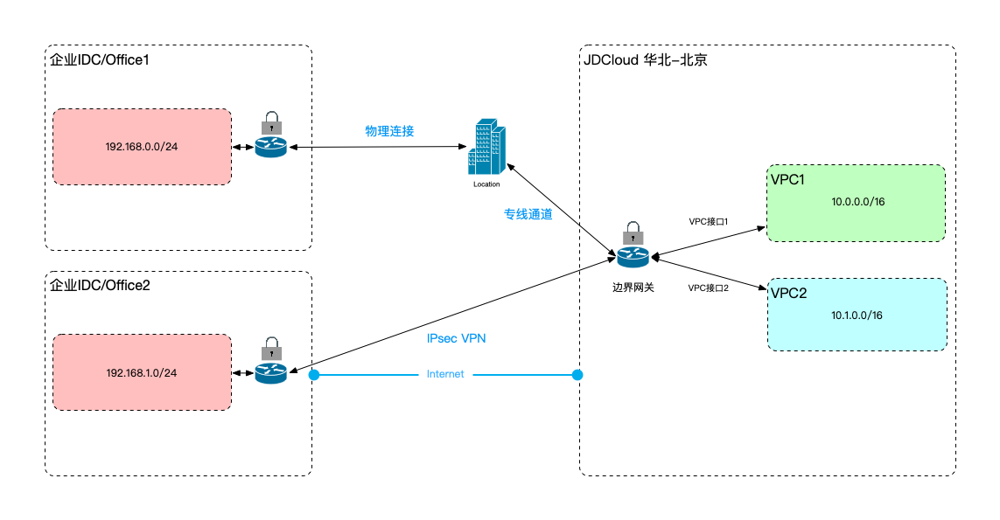

## VPN作为专线的备份，共同构建混合云

场景：客户希望将应用、数据库等部分资源部署在云端，将部分核心资源部署在企业的IDC内，由于数据量较大，或者对网络稳定性、延迟比较敏感，可使用专线作为主要链路，以IPsec VPN作为备用链路连接京东智联云和企业IDC/办公室内网环境。

```
  多个互联的网络环境之间内网网段不能冲突，并且本地数据中心的VPN网关必须配置至少一个静态公网IP(建议配置两个)。
  路由层面控制流量默认流经专线，当专线路由失效时，流量流经VPN连接。
```



专线VPN主备方案示例见[专线VPN混合云方案](../../Best-Practices/Connection-With-DirectConnect.md)。
