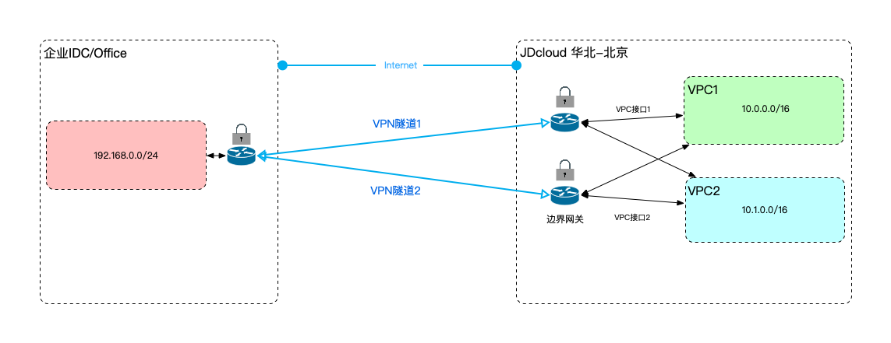

## 基础架构

### 概述

VPN产品由京东智联云自主研发，基于标准的IPsec协议，基于Site-To-Site模式，客户可以将其办公室、数据中心等场所和公有云VPN进行内网打通，实现不同环境的内网互访。VPN支持两阶段协商，分别是IKE、IPsec，其中IKE支持v1、v2，IPsec支持Route-Based，通过路由表控制实际互通的网段。

具体逻辑架构如下图：

### 组件

Border Gateway(bgw)：BGW作为VPC的边界网关，支持VPC之间、VPC与企业数据中心/办公室之间通过专线服务/VPN进行互通，用户可根据需求自行创建互联接口与通道/连接，并通过配置路由表实现不同业务网络之间的互通。

VPN Connection：VPN连接是一组云端公网地址和一组客户端公网地址间建立的VPN隧道的集合，用于分配VPN云端公网IP、统一隧道的路由方式(静态/BGP，建议使用BGP路由)。

VPN Tunnel：VPN隧道是一个云端公网地址和一个客户端公网地址间建立的业务通道，用于实际进行业务通信。为业务建立加密隧道，保证业务的传输安全，加密隧道的建立包括IKE和IPsec的两阶段协商，支持主流的加密、认证算法。

Customer Gateway(cgw)：客户网关是客户端设备在云端的逻辑表示，客户基于边界网关和客户网关建立VPN连接及VPN隧道，边界网关和客户网关间可运行BGP路由协议交换路由信息。
