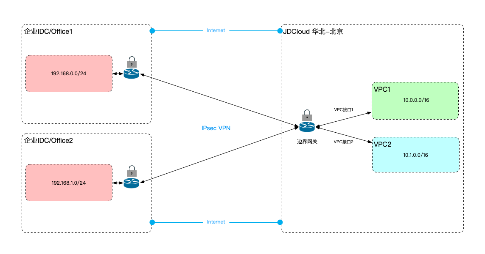

## 产品概述

### VPN概述

VPN(Virtual Private Network)是基于Internet的网络接入服务，属于混合云解决方案的一种实现方式。京东智联云提供基于IPsec的Site-To-Site VPN，在数据中心/办公室和云VPC之间建立加密隧道实现基于内网地址的网络通信，客户可基于该加密隧道进行应用迁移上云或混合云部署，并保障通信过程中的数据安全性。<br/>

VPN产品涉及的产品包括：边界网关、客户网关、VPN连接、VPN隧道。
其中：边界网关承载云端的VPN网关，客户网关为客户端VPN设备在云端的逻辑表示，客户基于边界网关和客户网关建立VPN连接，一个VPN连接表示一组云端公网IP和客户网关公网IP之间建立的全部VPN隧道的集合，故实现了隧道级的高可用。同时，客户可在云端和客户端之间建立多个VPN连接，实现连接级的高可用。

```
  为实现VPN连接的多个隧道间故障自动切换，强烈建议使用BGP动态路由进行路由设置，边界网关支持BGP路由，同时VPC路由表支持路由传播，故可动态地调整路由条目，从而实现故障链路的路由自动摘除。
```

### VPN整体结构



### 托管VPN VS 云内自建VPN

|  | 托管VPN | 云内自建VPN |
|:---:|:---:|:---:|
| 操作简便 | 通过控制台/API创建相应的VPN资源，与客户端之间建立VPN隧道 | 在云主机中安装VPN软件并进行相应的配置，使云主机作为VPN网关，与客户端之间建立VPN隧道 |
| 运维简便 | 由云厂商负责VPN的底层设施维护 | 由云厂商负责云主机的底层设施维护，由客户负责云主机中VPN软件的更新维护 |
| 高可用性 | 每个VPN连接自动分配两个云端公网IP，和客户端设备间建立至少两条VPN隧道，其中某条隧道出现故障时，BGP自动进行路由更新，业务平滑切换到可用的隧道上 | 创建多台云主机，与客户端设备建立多个VPN隧道，由客户自行实现BGP路由协议，进而实现VPN的高可用性 |
| 路由管理 | 通过开放的路由表控制路由 | VPN网关的云主机内路由需由客户自行维护，云主机外路由通过路由表控制 |
