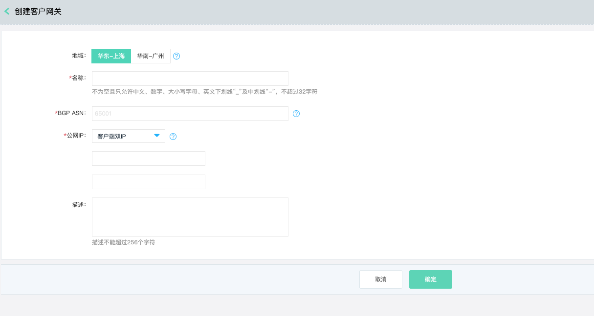
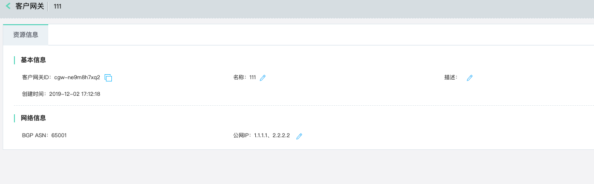
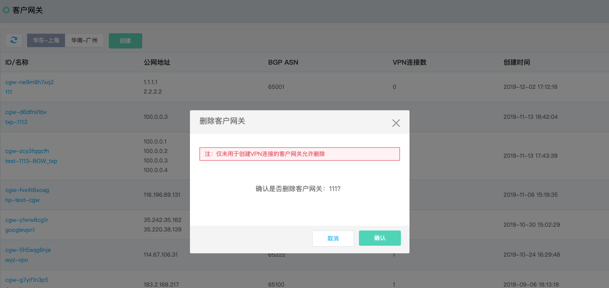

## 客户网关
客户网关(CGW，Customer Gateway)，客户网关是VPN连接中客户端设备在云端的逻辑表示，客户将基于VPN连接的公网地址和客户网关的公网地址创建IPsec VPN隧道。


### 操作步骤
##### 1.创建客户网关
a)登录[客户网关控制台](https://cns-console.jdcloud.com/host/customerGateway/list)；  <br />
b)选择地域，点击“创建”；<br />
c)输入客户网关的名称、BGP ASN、公网地址个数、公网地址、描述，创建客户网关；<br />
* BGP ASN用于VPN云端和客户端之间运行BGP路由协议时建立BGP会话使用，云端和客户端之间运行EBGP。
* 客户网关支持多个公网地址，基于业务高可用的考虑，请客户端至少使用两个公网地址与云端建立VPN隧道；

```
  客户端单IP适用于大多数业务场景，云端两个公网地址和客户端一个公网地址之间分别建立一条VPN隧道，共计两条隧道，基本满足业务高可用的需求。
  客户端双IP能极大地提升业务的可用性，云端两个公网地址和客户端两个公网地址间建立1对1的VPN隧道。
  客户端四IP适用于和Amazon AWS间的多云部署。
```


##### 2.修改客户网关
您可对客户网关的名称、描述及公网地址进行修改。<br />
a)登录[客户网关控制台](https://cns-console.jdcloud.com/host/customerGateway/list)；  <br />
b)选择相应的客户网关，进入客户网关详情页面；<br />
c)支持修改客户网关名称、描述及公网地址，各配置项的限制同创建客户网关，当该客户网关未创建VPN隧道时可以修改公网地址；<br />


##### 3.删除客户网关
若您不再需要客户网关，可将其删除。<br />
a)登录[客户网关控制台](https://cns-console.jdcloud.com/host/customerGateway/list)；  <br />
b)选择相应的客户网关，点击操作列中的“删除”，当该客户网关未创建VPN连接时可以删除；<br />



更多内容，详见[配置VPN连接](../../Operation-Guide/VPN-Connection-Management/VPN-Connection-Configuration.md)。
