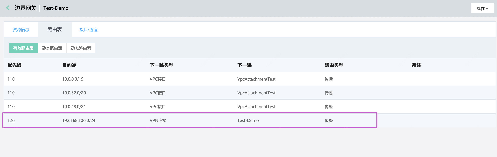

## 边界网关路由配置
在云端配置完VPN连接及VPN隧道后，还需要配置相应的路由，包括边界网关路由表路由和VPC路由表路由。

```
  若您在边界网关和客户网关之间运行BGP路由协议，则将基于VPN隧道IP、边界网关的ASN、客户网关的ASN运行EBGP，建立BGP会话。

  当您在客户端路由设备上宣告客户端网段后，与其建立BGP会话的边界网关将通过BGP协议自动将客户端路由学习到边界网关的动态路由表中，您无需在边界网关的静态路由表中手动添加。同时，边界网关会自动将其有效路由表中的路由宣告到客户端路由设备上。
```

以下步骤说明在边界网关上配置静态路由(``基于业务高可用的考虑，推荐使用BGP路由``)。

### 操作步骤
##### 1.创建VPC接口
创建VPC接口并设置VPC传播网段，详见[VPC接口管理](../../Operation-Guide/Border-Gateway-Management/VPC-Attachment-Configuration.md)。

##### (可选)2.边界网关路由表添加去往VPC的路由
若创建VPC接口时未指定传播的VPC网段，则可以手动添加去往VPC的路由。
a)登录[边界网关控制台](https://cns-console.jdcloud.com/host/borderGateway/list)；  <br />
b)点击相应的边界网关，进入边界网关详情页；<br />
c)在“路由表”Tab中将展示当前边界网关的有效路由表、静态路由表、动态路由表，点击“静态路由表”的“编辑”，选择“新增一条”，目的端为目的VPC内网段(如：192.168.0.0/24)，下一跳类型为VPC接口，下一跳为与目的VPC间创建的VPC接口，可对该路由添加备注。有关边界网关路由生效的的更多内容，详见[边界网关路由管理](https://docs.jdcloud.com/cn/direct-connection/border-gateway-features)；

```
  有效路由表存放边界网关中所有生效的路由条目。
  静态路由表存放边界网关中通过手动添加的路由条目。
  动态路由表存放边界网关通过BGP动态路由及路由传播学习到的路由条目。
```

##### 3.边界网关路由表添加去往客户端的路由
a)登录[边界网关控制台](https://cns-console.jdcloud.com/host/borderGateway/list)；  <br />
b)点击相应的边界网关，进入边界网关详情页；<br />
c)若VPN连接设置了启用BGP路由，且边界网关和客户网关之间能够正常建立BGP会话，则在客户端发布路由后，边界网关能够自动将客户端的路由加入路由表中，无需额外配置静态路由；<br />



d)可选配置静态路由，在“路由表”Tab中，点击“静态路由表”的编辑，选择“新增一条”，，目的端为客户端网段(如：10.0.0.0/16)，下一跳类型为VPN连接，下一跳为与客户网关之间创建的VPN连接，可对该路由添加备注；<br />


```
  由于VPN连接中包含多条VPN隧道，默认情况下，流量将流经全部隧道状态为“UP”的VPN隧道，若要流量不流经某条VPN隧道，请断开该隧道，或将该隧道禁用。
```
