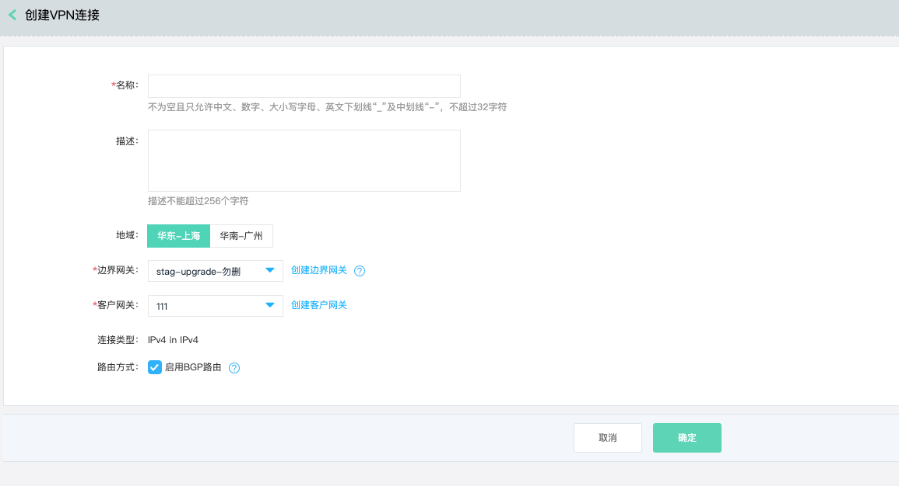
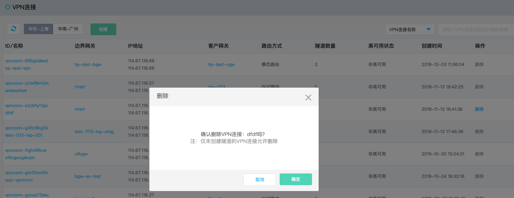

## VPN连接
VPN连接(VPN Connection)，VPN连接是一组云端公网地址和一组客户端公网地址间建立的多条VPN隧道的集合。

有关VPN隧道的更多内容，详见[VPN隧道操作](../../Operation-Guide/Client-Site-Configuration/Cisco-Configuration.md)。

### 操作步骤
##### 1.创建VPN连接
a)登录[VPN连接控制台](https://cns-console.jdcloud.com/host/vpnConnection/list)；  <br />
b)选择地域，点击“创建”；<br />
c)输入VPN连接的名称、描述、边界网关、客户网关、路由方式，创建VPN连接；<br />

```
  当前VPN连接仅支持隧道内外层地址均为IPv4地址簇，后续会支持IPv6地址簇。

  路由方式支持静态路由和BGP路由，使用BGP路由时，将使用VPN隧道的隧道IP作为互联地址，以边界网关的BGP ASN、客户网关的BGP ASN建立BGP会话。
  客户即使指定了使用BGP路由，仍然可以通过配置静态路由实现数据转发。

  VPN连接的高可用状态：当VPN连接的客户网关存在至少两个公网地址，云端的两个公网地址分别和客户端不同的公网地址之间建立了VPN隧道，且云端的每个公网地址所创建的VPN隧道中均至少有一个隧道的运行状态是UP，此时VPN连接的高可用状态为“高可用”，否则为“非高可用”。
```



##### 2.修改VPN连接
您可对VPN连接的名称、描述及路由方式进行修改。<br />
a)登录[VPN连接控制台](https://cns-console.jdcloud.com/host/vpnConnection/list)；  <br />
b)选择相应的VPN连接，进入VPN连接详情页面；<br />
c)支持修改VPN连接名称、描述及路由方式，各配置项的限制同创建VPN连接；<br />
```
  路由方式由启用BGP修改为静态时，将立即断开所有隧道的BGP会话，仅谨慎操作。

  路由方式由静态修改为启用BGP时，将使用VPN隧道的隧道IP作为互联地址，以边界网关的BGP ASN、客户网关的BGP ASN建立BGP会话。
```


##### 3.删除VPN连接
若您不再需要VPN连接，可将其删除。<br />
a)登录[VPN连接控制台](https://cns-console.jdcloud.com/host/vpnConnection/list)；  <br />
b)选择相应的VPN连接，点击操作列中的“删除”，当该VPN连接未创建VPN隧道时可以删除；<br />

