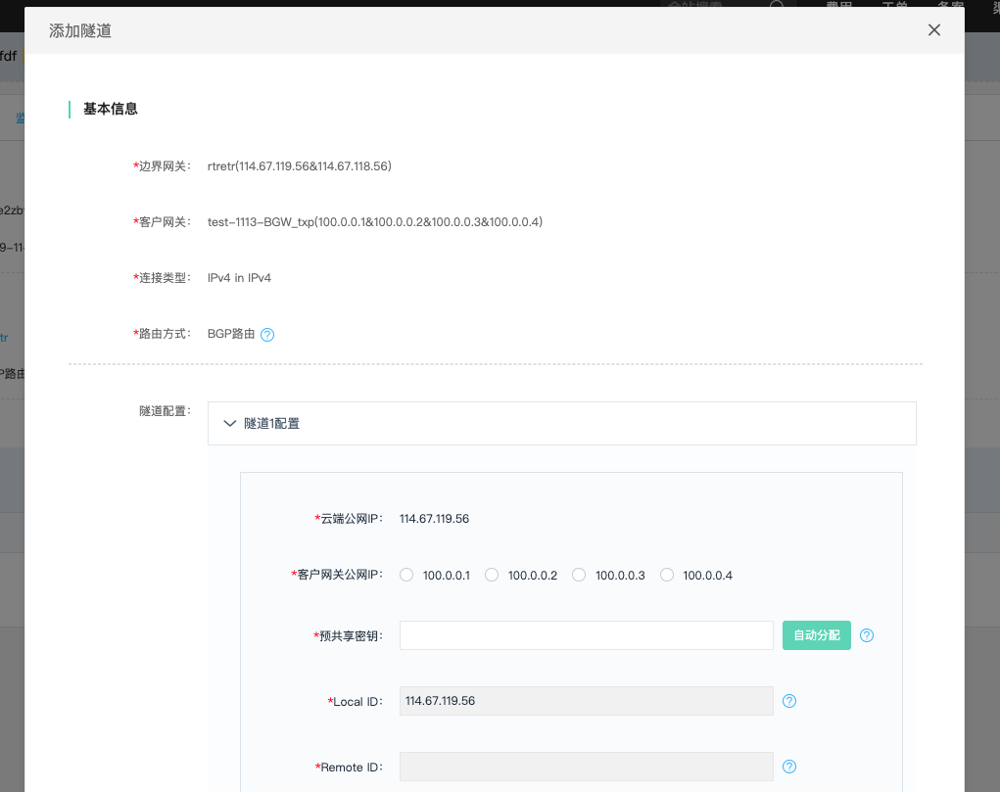
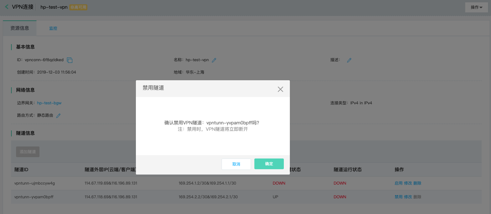
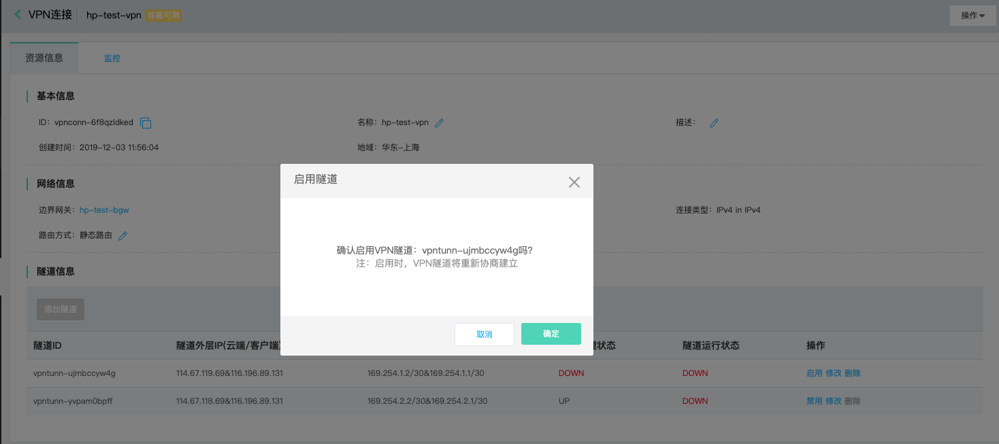
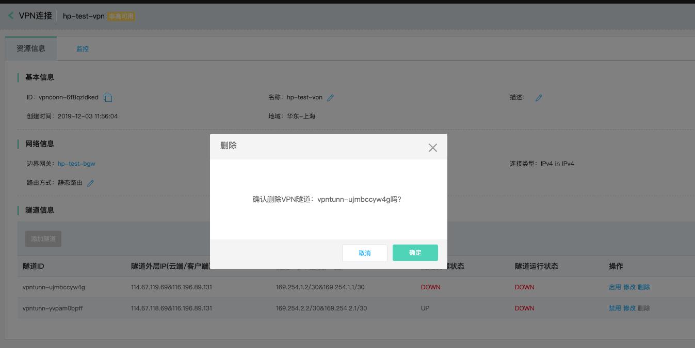

## VPN隧道
VPN隧道(VPN Tunnel)，VPN隧道是一个云端公网地址和一个客户端公网地址间建立的IPsec Site-To-Site加密通道，用于保证不同网络环境的业务进行安全通信。VPN隧道的建立包括IKE和IPsec的两阶段协商，支持安全性较高的加密、认证算法。    <br />

### 操作步骤
##### 1.创建VPN隧道
a)登录[VPN连接控制台](https://cns-console.jdcloud.com/host/vpnConnection/list)；  <br />
b)选择相应的VPN连接，进入VPN连接详情页面；<br />
c)点击“资源信息”Tab中的“添加隧道”，初次创建隧道时(VPN连接当前没有创建过隧道或已将隧道全部删除)，会根据您所选择客户网关的公网地址数量，基于高可用的配置而进行页面初始化，默认至少两条隧道(云端的两个公网地址各自一条隧道，适用于客户网关为单IP和双IP的情况)，当客户网关为四IP时，默认初始化四条隧道(云端的两个公网地址各自两条隧道)。非初次创建隧道时，每次只能创建一条隧道； <br />
d)同一VPN连接下的所有VPN隧道使用相同的路由方式，即在VPN连接上设置的路由方式；<br />
e)为每个隧道分别配置两阶段协商所使用的参数，包括IKE版本、预共享密钥、隧道两端网关标识、隧道内层IP(用于隧道内路由数据包)，以及两阶段的认证算法、加密算法、SA声明周期等；<br />


###### VPN隧道参数说明：
| 模块 | 参数名称 | 参数说明 |
|:---:|:---:|:---:|
| 通用 | 云端公网IP | VPN隧道的云端公网地址 |
|  | 客户网关公网IP | VPN隧道的客户端公网地址 |
|  | Local ID | 隧道的云端标识 |
|  | Remote ID | 隧道的客户端标识 |
|  | 隧道IP | 隧道内层地址，用于配置路由、数据转发使用 |
| 第一阶段协商(IKE) | 预共享密钥 | Pre-shared Key，用于边界网关与客户网关之间身份认证的密钥，支持自行输入，或由系统自动生成 |
|  | IKE版本 | 使用的IKE版本，支持v1/v2，为了更高的安全性，建议使用v2，更多信息请参考RFC 2409和RFC 7296 |
|  | 协商模式 | IKE v1时需要，支持主模式和野蛮模式，推荐使用主模式 |
|  | DH Group | Diffie-Hellman Perfect Forward Secrecy(PFS)，更多信息请参考RFC 2409 |
|  | 认证算法 | 用于IKE SA的认证，更多信息请参考RFC 2404 |
|  | 加密算法 | 用于保证IKE SA的安全性，更多信息请参考RFC 3602 |
|  | IKE SA Lifetime(s) | IKE SA的生命周期，单位为：秒，在此生命周期结束前将协商使用新的SA |
| 第二阶段协商(IPsec) | 报文封装模式 | 支持隧道模式，该模式下使用新的数据包封装原始数据包，支持NAT-Traversal |
|  | 安全协议 | 支持ESP，在封装模式为隧道模式时对整个数据包进行加密封装，包括包头和数据载荷 |
|  | DH Group | Diffie-Hellman Perfect Forward Secrecy(PFS)，更多信息请参考RFC 2409 |
|  | 认证算法 | 用于IPsec SA及数据载荷完整性的认证等，更多信息请参考RFC 2404 |
|  | 加密算法 | 用于保证IPsec SA和数据载荷的安全性，更多信息请参考RFC 3602 |
|  | IPsec SA Lifetime(s) | IPsec SA的生命周期，单位为：秒，表示从一个SA产生后的有效时间段，在此生命周期结束前将协商使用新的SA |
|  | IPsec SA Lifetime(Byte) | IPsec SA的生命周期，单位为：字节，表示从一个SA产生后通信的字节数，在此生命周期结束前将协商使用新的SA |
|  | IPsec SA Lifetime(Packet) | IPsec SA的生命周期，单位为：个，表示从一个SA产生后通信的数据包数，在此生命周期结束前将协商使用新的SA |
|  | DPD | Dead Peer Detection，默认关闭，若开启，则在没有业务流量时，每10s发送探测消息，以保持隧道活性，更多信息请参考RFC 3706 |

```
  VPN隧道的参数很多都给出了默认值，这些默认值是我们在经过多次实际业务和安全测试后确定下来的推荐配置，不建议客户使用低于这些配置的选项。
```

##### 2.修改VPN隧道
您可对VPN隧道的隧道IP、预共享密钥、IKE版本等参数进行修改。<br />
a)登录[VPN连接控制台](https://cns-console.jdcloud.com/host/vpnConnection/list)；  <br />
b)选择相应的VPN连接，进入VPN连接详情页面；<br />
c)支持修改VPN隧道的隧道IP、IKE、IPsec等参数，各配置项的限制同创建VPN隧道；<br />

```
  修改隧道配置前，请先将路由切换到其它VPN隧道并在云端“禁用”VPN隧道，云端及客户端设备更新配置完成后，再次“启用”隧道并将路由切换回此隧道，避免由于路由问题及隧道断开并以新配置重建而造成业务断流。
```


##### 3.维护VPN
当客户端VPN设备或云端VPN组件需要升级维护时，会短暂断开VPN连接下的某条隧道，待升级维护完成后，会重新协商建立此隧道，强烈建议客户使用BGP路由；

```
  云端VPN组件升级维护时，会自动将路由变更到其它隧道，并禁用待维护的隧道，待升级维护完成，会启用隧道并自动将路由切换回此隧道。
  客户端VPN设备升级维护时，建议和云端VPN组件升级维护使用相同的流程和操作步骤。
```






##### 4.删除VPN隧道
若您不再需要VPN隧道，可将其删除。<br />
a)登录[VPN连接控制台](https://cns-console.jdcloud.com/host/vpnConnection/list)；  <br />
b)选择相应的VPN连接，进入VPN连接详情页，选择“隧道信息”中响应的VPN隧道，点击操作列中的“删除”。避免意外删除运行中的VPN隧道，只有当该VPN隧道管理状态为“DOWN”时可以删除；<br />


##### 5.查看VPN隧道的监控信息
a)登录[VPN连接控制台](https://cns-console.jdcloud.com/host/vpnConnection/list)；  <br />
b)选择相应的VPN连接，进入VPN连接详情页面；<br />
c)点击“监控”Tab，可以查看该VPN连接下当前存在的所有VPN隧道的监控信息，监控指标包括：隧道原始流出流量速率、隧道原始流入流量速率、隧道加密后流出流量速率、隧道加密后流入流量速率、隧道流出数据包速率、隧道流入数据包速率；<br />


有关VPN隧道监控的更多信息，详见[VPN监控](../../Operation-Guide/VPN-Connection-Management/VPN-Connection-Monitoring.md)。

有关配置隧道客户端VPN设备的方式，详见：[客户端配置](../../Operation-Guide/Client-Site-Configuration/Cisco-Configuration.md)。
