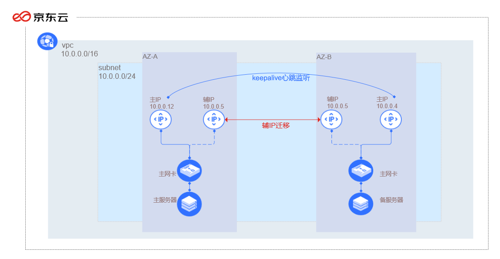

# 基于keepalived实现主备双主机高可用

本文档描述了在京东云平台环境下基于keepalived构建高可用服务的操作指南。
## 应用场景
通过keepalived实现主备服务器内网IP的热迁移实现高可用，keepalived软件专门是为主、备方式高可用架构设计，在主服务器发生故障时，可以通过内建的心跳监听机制，将主服务器上的内网IP迁移至备用服务器上实现业务切换至备服务器。业务架构如下图所示：



如上图所示，业务架构中包括2台云主机，2台云主机位于同一子网内，其中主服务器位于可用区A，备服务器位于可用区B。主服务器主网卡上分配2个内网IP，主IP随云主机一同创建，辅IP作为VIP对外提供服务；备服务器主网卡上分配1个内网IP，为主网卡主IP。主服务器与备服务器之间通过keepalived软件实现互相监听，在主服务器发生故障时，keepalived可以调用京东云Open API，将主服务器的辅IP迁移至备服务器，从而保证业务的正常运行。

## 前提条件

- 确保您已经[注册京东云账号](https://user.jdcloud.com/register?returnUrl=https%3A%2F%2Fwww.jdcloud.com%2F)，并实现[实名认证](https://docs.jdcloud.com/cn/real-name-verification/introduction)；
- 确保账户中有足够余额，确保能顺利创建付费云资源；
- 确保相关资源有足够的配额。

## 操作步骤

- [部署云资源](keepalived#user-content-1)
- [服务器配置](keepalived#user-content-2)
- [测试](keepalived#user-content-3)


## 操作步骤

<div id = "user-content-1"> </div>

### 部署云资源

#### 网络部署

步骤1：登录京东云用户控制台，进入网络-私有网络-私有网络页面，点击创建。

步骤2：新建私有网络页面，地域选择“华北-北京”，名称填写“私有网络1”，私有网络CIDR设置为“10.0.0.0/16”，描述留空。

步骤3：点击确定按键，返回私有网络列表页，查看私有网络创建情况。

步骤4：进入网络-私有网络-子网页面，点击创建。

步骤5：新建子网页面，地域选择“华北-北京”，名称填写“子网1”，私有网络选择“私有网络1”，子网CIDR设置为“10.0.0.0/24”，路由表选择“默认路由表”，描述留空。

步骤6：点击确定按键，返回子网列表页，查看子网创建情况。

#### 计算资源部署

本文档采用京东云平台提供的CentOS 7.6 版本镜像以及yum源中的keepalived 1.3.5版本软件进行操作说明。

> 注：用户可根据实际业务需求选择Linux操作系统以及特定软件版本，不同版本Linux操作系统相关配置可能会存在差异。

步骤1：登录京东云用户控制台，进入弹性计算-云主机-实例页面，点击创建。

步骤2：创建云主机页面，计费方式选择“按配置”，地域选项选择“华北-北京”，可用区选择“可用区A”，创建方式选择“自定义创建”，镜像类型选择“官方”，分类选择“本地盘系统盘”，官方镜像选择“CentOS 7.6”，云主机规格选择“通用型g.n2.medium”，存储保留默认配置，网络选择“私有网络1”，子网选择“子网1”，内网IP选择“自定义”并指定为“10.0.0.12”，安全组选择“默认安全组开放全部端口”，带宽选择“按固定带宽”计费，线路选择“BGP”，带宽上限选择“1Mbps”，名称填写“主服务器”，描述留空，购买数量选择1，点击立即购买按键。

步骤3：订单确认页面，点击立即开通，主服务器创建成功。

步骤4：创建云主机页面，计费方式选择“按配置”，地域选项选择“华北-北京”，可用区选择“可用区B”，创建方式选择“自定义创建”，镜像类型选择“官方”，分类选择“本地盘系统盘”，官方镜像选择“CentOS 7.6”，云主机规格选择“通用型g.n2.medium”，存储保留默认配置，网络选择“私有网络1”，子网选择“子网1”，内网IP选择“自定义”并指定为“10.0.0.4”，安全组选择“默认安全组开放全部端口”，带宽选择“按固定带宽”计费，线路选择“BGP”，带宽上限选择“1Mbps”，名称填写“备服务器”，描述留空，购买数量选择1，点击立即购买按键。

步骤5：订单确认页面，点击立即开通，备服务器创建成功。

步骤6：在主服务器上分配一个内网辅IP，进入弹性计算-云主机-实例页面，定位到步骤2中创建的云主机“主服务器”，点击云主机ID进入云主机详情页面。

步骤7：云主机详情页面，切换至弹性网卡管理页面，选定主网卡，点击分配内网IP按键。

步骤8：分配内网IP按键，分配IP选择“自定义”模式并指定为“10.0.0.5”，点击确定按键，完成辅助IP分配。

<div id = "user-content-2"> </div>

### 服务器配置

本章节将介绍本文档所描述的测试环境中云主机需要的软件的安装与配置。主要工作包括京东云Python SDK环境安装、keepalived安装与配置等。分别在主服务器和备用服务器上执行以下操作：

步骤1：通过SSH以root权限远程登录主/备服务器。

步骤2：执行以下命令安装pip工具。

```
yum -y install python-pip
```
步骤3：执行以下命令安装京东云Python SDK。

```
pip install -U jdcloud_sdk
```
步骤4：执行以下命令安装keepalived软件。
```
yum -y install keepalived
```
步骤5：执行以下命令编辑keepalived.conf配置文件

```
vi /etc/keepalived/keepalived.conf
```
步骤6：将keepalived.conf文件中替换为以下内容，下例以配置主服务器为例，在配置备用服务器的时候，unicast_src_ip处的IP地址配置成备用服务器的主ip；unicast_peer出的内网IP改成主服务器的主IP
```
! Configuration File for keepalived

global_defs {
   notification_email {
     acassen@firewall.loc
     failover@firewall.loc
     sysadmin@firewall.loc
   }
   notification_email_from Alexandre.Cassen@firewall.loc
   smtp_server 192.168.200.1
   smtp_connect_timeout 30
   router_id LVS_DEVEL
   vrrp_skip_check_adv_addr
   # vrrp_strict
   vrrp_garp_interval 0
   vrrp_gna_interval 0
}

vrrp_instance VI_1 {
    state BACKUP
    interface eth0
virtual_router_id 51
nopreempt
    priority 50
    advert_int 1
    authentication {
        auth_type PASS
        auth_pass 1111
}
unicast_src_ip 10.0.0.12
unicast_peer {
    10.0.0.4
}
    virtual_ipaddress {
        10.0.0.5
}

notify_master "/etc/keepalived/notify_action.sh MASTER"
notify_backup "/etc/keepalived/notify_action.sh BACKUP"
notify_fault "/etc/keepalived/notify_action.sh FAULT"
notify_stop "/etc/keepalived/notify_action.sh STOP"
garp_master_delay 1
garp_master_refresh 5

track_interface {
    eth0
}
}
```

步骤7：进入/etc/keepalived路径并创建notify_action.sh文件，并进入该文件编辑模式

```
cd /etc/keepalived
touch notify_action.sh
vi notify_action.sh
```

步骤8：在notify_action.sh文件中写入以下内容
```
#!/bin/bash
#/etc/keepalived/notify_action.sh

log_file=/var/log/keepalived.log
log_write()
{
        echo "[`date '+%Y-%m-%d %T'`] $1" >> $log_file
}

if [ $1 == 'MASTER' ]; then
        echo -n "$1" > /var/keepalived/state
        log_write " notify_master" 
        echo -n "0" > /var/keepalived/vip_check_failed_count       
        python /etc/keepalived/switch_sip.py
fi

if [ $1 == 'BACKUP' ]; then
        echo -n "$1" > /var/keepalived/state
        log_write " notify_backup" 
fi

if [ $1 == 'FAULT' ]; then
        echo -n "$1" > /var/keepalived/state
        log_write " notify_fault" 
fi

if [ $1 == 'STOP' ]; then
        echo -n "$1" > /var/keepalived/state
        log_write " notify_stop" 
fi
```
步骤9：创建日志记录文件夹以及日志记录文件
```
mkdir /var/keepalived
touch /var/log/keepalived.log
touch /var/keepalived/state
touch /var/keepalived/vip_check_failed_count
```
步骤10：修改keepalived.conf与notify_action.sh文件的执行权限
```
chmod 744 /etc/keepalived/notify_action.sh
chmod 644 /etc/keepalived/keepalived.conf
```
步骤11：在/etc/keepalived路径下创建switch_sip.py文件，并进入该文件编辑模式
```
touch switch_sip.py
vi switch_sip.py
```
步骤12：在switch_sip.py文件中写入以下内容，其中账户AK，账户SK，云主机主网卡ID等参数请于控制台查看。
```
from jdcloud_sdk.core.credential import Credential
from jdcloud_sdk.services.vpc.client.VpcClient import VpcClient
from jdcloud_sdk.services.vpc.apis.AssignSecondaryIpsRequest import AssignSecondaryIpsParameters, AssignSecondaryIpsRequest

access_key = '账户AK'
secret_key = '账户SK'
credential = Credential(access_key, secret_key)
client = VpcClient(credential)

try:
    parameters = AssignSecondaryIpsParameters(regionId='cn-north-1', networkInterfaceId='云主机主网卡ID')
    secondaryIps=['10.0.0.5']
    parameters.setSecondaryIps(secondaryIps)
    request = AssignSecondaryIpsRequest(parameters)
    resp = client.send(request)
    
    if resp.error is not None:
        print resp.error.code, resp.error.message
    print resp.result
    
except Exception, e:
    print e
```

> 上述文件的账户AK、账户SK内容更改为您账户对应的AK、SK。云主机网卡ID分别在配置主服务器时更改为对应的主服务网卡ID，在配置备用服务器时改为备用服务器的主网卡ID，secondaryIps的值改为辅IP

<div id = "user-content-3"> </div>

### 测试

步骤1：通过SSH以root权限远程登录主服务器。

步骤2：执行以下命令重启keepalived。
```
systemctl restart keepalived
```

步骤3：通过控制台或者登录备服务器后执行以下命令在备服务器上查看IP分配情况。

```
ip addr list
```
步骤4：如备用服务器中有辅IP，则表示迁移成功，在客户端，通过ping命令测试与VIP地址或VIP地址关联的弹性公网IP的连通性。
```
ping 10.0.0.5
```

## 相关参考

- [创建VPC](../Operation-Guide/VPC-Configuration.md)
- [创建子网](../Operation-Guide/Subnet-Configuration.md)
- [创建云主机](https://docs.jdcloud.com/cn/virtual-machines/create-instance)
- [分配内网IP](https://docs.jdcloud.com/cn/virtual-machines/assign-secondary-ips)

本文档中如有遗漏与错误，请反馈至京东云IaaS产品团队，IaaS产品团队将持续改进文档，为用户提供优质的服务。
