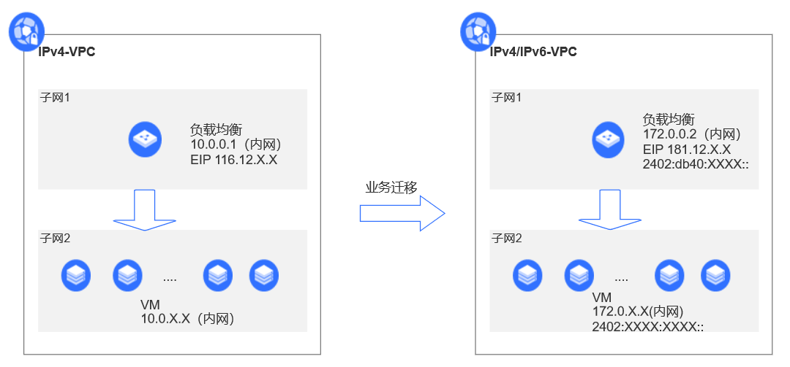
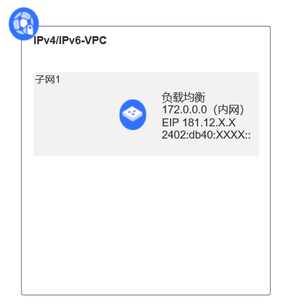
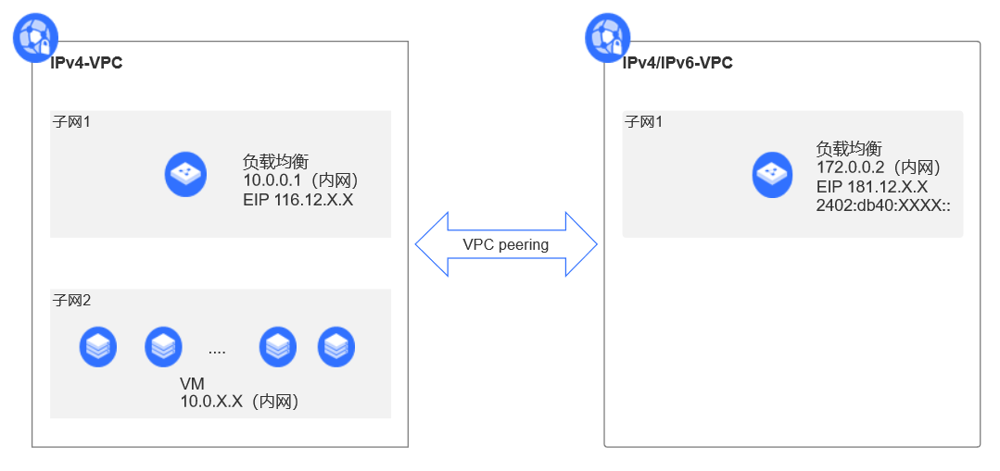
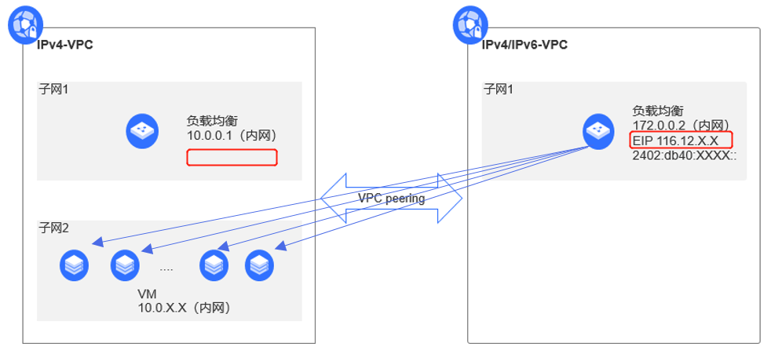

# **IPv4私有网络业务迁移至IPv4/IPv6双栈网络**

本教程将介绍如何将已有的IPv4私有网络（本例简称“单栈VPC”）业务迁移至IPv4/IPv6双栈网络（简称“双栈VPC”）中，使得服务能够被IPv4用户和IPv6用户同时访问。

 
 

## 前提条件

- 首先您需要有京东智联云的账号，并完成实名认证，若您目前没有账号，请先[注册](https://user.jdcloud.com/register?source=jdcloud&ReturnUrl=https%3A%2F%2Fwww.jdcloud.com)。
- 已有IPv4私有网络部署环境。

## 操作步骤

### 步骤一、搭建IPv4/IPv6双栈VPC

  目标：创建一个双栈VPC，包含一个子网，一个负载均衡。

  

 1. 进入[京东智联云官方网站](https://www.jdcloud.com/)；点击网页右上角的控制台，选择私有网络，创建IPv6 VPC，具体操作请参考[VPC配置](https://docs.jdcloud.com/cn/virtual-private-cloud/vpc-configuration)，填写相关信息，【IPv6 CIDR】字段，选择“京东智联云提供的IPv6 CIDR”。
 
 2. 选择子网，在已创建的VPC中分别创建两个支持IPv6的子网1，具体操作请参考[子网配置](https://docs.jdcloud.com/cn/virtual-private-cloud/subnet-configuration)，【私有网络】字段选择IPv6类型的VPC，勾选【IPv6 CIDR】（若不勾选即创建IPv4单栈子网），指定IPv6 CIDR范围。

 3. 在步骤2创建的子网中创建支持IPv6的负载均衡，类型与已有IPv4私有网络中的负载均衡类型一致，本例为应用型负载均衡，网络配置中选择上述步骤中创建的IPv6私有网络和子网，勾选“自动分配IPv6地址”，点击立即购买支付完成即创建双栈VPC成功。

### 步骤二、通过VPC peering连接单栈VPC和双栈VPC

 目标：通过VPC peering连接单栈VPC和双栈VPC，使得两个VPC通过内网IP地址进行通信。

 

 1. 分别以上述两个VPC中的一个VPC作为本端VPC，另外一个VPC的ID作为对端VPC ID创建VPC对等连接，具体操作请参考[创建VPC对等连接](https://docs.jdcloud.com/cn/virtual-private-cloud/vpc-peering-configuration)。

 2. 分别配置单栈VPC和双栈VPC的路由策略，下一跳类型选择VPC对等连接，下一跳分别选择步骤1中创建的VPC对等连接。

 3. 配置完路由表需将路由表绑定至需要互通的子网，并在对端私有网络中需使用同样的步骤创建、配置并绑定路由表。配置完成后两端VPC即可通过内网IP建立连接。

### 步骤三、配置负载均衡

 目标：将单栈VPC中的云主机挂载到双栈VPC的负载均衡上。

 

 1. 进入已创建的双栈VPC中负载均衡的详情页，首先选择配置虚拟服务器组，点击新建虚拟服务器组，其中一个类型选择IP，点击注册IP，输入单栈VPC中需要支持IPv6地址的云主机的内网IP地址，虚拟服务器组创建完成后进入下一步。

 2. 配置监听器，选择监听协议及端口，若选择HTTPS/TLS协议，选择已有证书或新建证书，配置后点击下一步进入后端转发配置，配置相关内容，点击下一步进入健康检查，配置相关内容，点击下一步进入添加服务器组，选择“虚拟服务器组/IP类型”，选择相应的IP类型的服务器组。

 3. 进入后端服务，确认创建的后端服务中的健康检查的状态为正常，若状态正常，则进入测试，若一直处于异常状态，请检查云主机的服务是否启动。

 4. 访问双栈VPC中的负载均衡的IPv6地址，若能够访问服务，则表示云主机挂载成功。

 5. 将单栈VPC中负载均衡的公网IP绑定到双栈VPC中的负载均衡上。
   

完成上述步骤即可完成单栈业务迁移至双栈VPC，可对IPv4私有网络中的负载均衡资源进行释放，避免产生不必要的费用。
