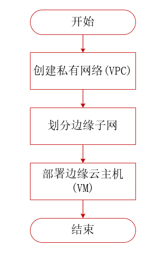

# 在边缘可用区创建云主机实例 


### 应用场景

您的业务所在的地理位置距离边缘可用区更近，且边缘服务满足您的需求，您期望部署在边缘可用区。

### 操作流程




### 前提条件及可用区限制

- 确保您已经[注册京东云账号](https://user.jdcloud.com/register?returnUrl=https%3A%2F%2Fwww.jdcloud.com%2F)，并实现[实名认证](https://realname.jdcloud.com/account/verify)；

- 确认您已有边缘可用区使用权限，如无相关权限请提工单申请；
- 确保账户中有足够余额；
- 确保需要创建的资源数量配额充足，如需提升配额请提[工单申请](https://ticket.jdcloud.com/applyorder/submit)；
- 华南-广州地域支持边缘服务，更限制请参考[地域及可用区](https://github.com/jdcloudcom/cn/blob/Doc/documentation/Networking/Virtual-Private-Cloud/Introduction/Region-Az.md)。

### 操作步骤

#### 创建私有网络

<div id="user-content-1"> </div>

步骤1：登录京东云控制台，进入控制台导航页面；

步骤2：在控制台左侧导航栏，选择网络-私有网络，进入私有网络列表页；

步骤3：点击【创建】，出现创建弹窗，选择需要部署资源的地域，目前华南-广州地域支持边缘服务；

```
地域一旦确定后，就确定了后续其他资源的部署地域，不可更改，请根据实际业务选择地域。
```
步骤4：填充相关信息，选择私有网络CIDR，京东云支持的网段如下：
  - 10.0.0.0/16~10.255.0.0/28
  - 172.16.0.0/16~172.32.0.0/28
  - 192.168.0.0/16~192.168.0.0/28
```
边缘可用区暂不支持IPv6服务，如需支持IPv6请在中心可用区部署资源。
```
步骤5：确认信息后，点击【确定】完成创建VPC。


#### 创建边缘子网 

<div id="user-content-2"> </div>

步骤1：登录京东云控制台，进入控制台导航页面；

步骤2：在控制台左侧导航栏，选择网络-私有网络-【子网】，进入子网列表页；

步骤3：点击【创建】，弹出子网创建弹窗，地域选择华南-广州地域，可用区选择边缘可用区，在私有网络选项中选择上述创建的私有网络；

```
如需选择上述创建的私有网络，须选择该私有网络所在的地域。
```
步骤4：补充子网名称，选择子网CIDR，选择路由表；

```
如有特殊需求可选择先关联默认路由表，完成子网创建，然后创建新的路由表，将子网与自定义的路由表关联，如须访问公网，自定义路由表须配置访问Internet的路由策略。
```
步骤5：确认信息后，点击【确定】完成创建子网。

#### 在该边缘子网中创建边缘云主机

<div id="user-content-3"> </div>

步骤1：登录京东云控制台，进入控制台导航页面；

步骤2：在控制台左侧导航栏，选择弹性计算-【云主机】，默认进入云主机实例列表页；

步骤3：选择上述子网或私有网络的地域，点击【创建】，进入云主机创建页面，选择边缘可用区-佛山南海；

步骤4：选择创建方式、镜像、规格、硬盘等，更多请参考[创建云主机实例](https://docs.jdcloud.com/cn/virtual-machines/create-instance)；

步骤5：找到网络模块，选择上述创建的私有网络和子网，将本次创建的云主机部署在该私有网络的子网下；

步骤6：选择安全组，可选择默认安全组，京东云支持三组默认安全组，请根据业务需求选择安全组，如自定义安全组，默认拒绝所有访问，需[配置安全组规则](https://docs.jdcloud.com/cn/virtual-private-cloud/security-group-configuration)；

步骤6：完成相关信息编辑后，点击【立即购买】进入订单确定页，完成支付即完成云主机创建。


#### 在边缘可用区创建边缘公网IP

#### 操作步骤

步骤1：登录京东云控制台，进入控制台导航页面。

步骤2：在控制台左侧导航栏，选择网络-【私有网络】-【弹性公网IP】，进入弹性公网IP列表页。

步骤3：确认您需要创建弹性公网IP的地域，在弹性公网IP列表页选中对应地域标签，点击申请按键，进入创建弹性公网IP页面。

	目前支持在华南-广州地域创建边缘公网IP。

步骤4：在创建弹性公网IP页面，选择您要创建的弹性公网IP的带宽计费模式。

	边缘公网IP支持包年包月、按配置两种计费类型。

步骤5：在创建弹性公网IP页面，选择您要创建的弹性公网IP的IP类型、线路以及带宽上限。

    边缘公网IP的线路按不同地域、不同边缘可用区进行了独立定义。
    请根据业务需要的线路接入区、需要的资源关联范围、不同运营商服务类型等信息选择合适的边缘公网IP线路。

步骤6：如果选择包年包月计费类型，需要选择购买时长。

	目前包年包月计费类型的购买时长包括1-9个月、1年、2年、3年。

步骤7：指定需要创建的弹性公网IP数量，上限值受弹性公网IP配额数量限制。

步骤8：完成上述步骤后，点击立即购买按键，进入订单确认以及支付页。完成支付后，返回弹性公网IP列表页，查看弹性公网IP创建情况。


## 相关参考
- [创建公网IP](../../Elastic-IP/Operation-Guide/Elastic-IP-Management/Create-Elastic-IP.md)
- [创建云主机](https://docs.jdcloud.com/cn/virtual-machines/create-instance)
- [常见问题](../FAQ/FAQ.md)
