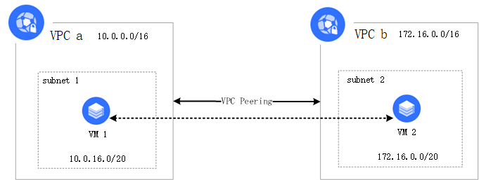
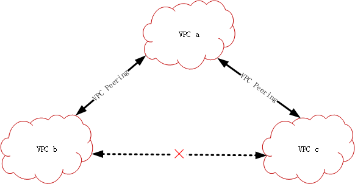

## **VPC对等连接**

### **基本概念**

VPC 对等连接（VPC Peering）是一种跨VPC网络互联的服务，可以使私有网络IP在对等VPC之间路由流量，就像它们属于同一VPC一样。您可以实现同地域下相同或不同用户的私有网络互联，通过在两端配置路由策略，可以实现不同私有网络的流量互通。对等连接不依赖某个独立硬件，因而不存在单点故障或带宽瓶颈，支持更多的应用场景，如游戏跨地域同服等。



### 产品特点

- 高质量，不同私有网络之间的资源通信不受公网质量影响，且带宽无上限限制，可用性大幅度提高，时延、丢包率降低；
- 安全，同地域私有网络间的资源通信走京东云内网，不经过公网，避免了数据在传输过程中被窃听的风险；
- 节省公网成本，私有网络间的资源通过VPC对等连接通信，使用内网IP地址通信，无需使用公网IP地址，节省带宽成本。

**对等连接互通性不传递**

对等连接使私有网络之间两两建立互联，但是这种互通关系不发生传递。如下图所示，VPC a与VPC b建立了对等连接，VPC a和VPC c也建立了对等连接。然而由于对等连接的不传递性，VPC b和VPC c之间的私有IP流量不能互通，可通过公网进行通信。



### **状态解释**

- 初始化：单边VPC创建VPC对等连接，对端VPC并未创建VPC对等连接。
- 已连接：两边VPC均已创建VPC对等连接。
- 已断开：其中一边删除VPC对等连接，另一边状态置为已断开。
```
提示
如两端均创建了VPC对等连接，需配置两端路由策略，资源才能互相通信
```

### **计费模式**

同地域对等连接：免费。


### **使用约束**

关于对等连接，有以下几点您需要注意：

- 要使对等连接两端实现真正的通信，必须保证本端和对端的相关路由表上配置相关路由规则。
- 当前仅支持同地域下VPC之间创建VPC对等连接，支持同地域跨账户使用VPC对等连接；
- VPC通过VPC对等连接实现的互通性不传递；
- 对等连接的两端私有网络 CIDR 不可以重叠，重叠时创建会报错；
- 对等连接任意一方可以随时中断对等连接。中断后两个私有网络间流量则立即中断；
- 同地域对等连接无带宽上限。

## 相关参考
- [路由表功能概述](Route-Table-Features.md)
- [使用限制](../Restrictions.md)
- [VPC功能概述](VPC-Features.md)
- [配置VPC对等连接](../../Operation-Guide/VPC-Peering-Configuration.md)
- [配置VPC](../../Operation-Guide/VPC-Configuration.md)
- [配置路由表](../../Operation-Guide/Route-Table-Configuration.md)
- [常见问题](../../FAQ/FAQ.md)
