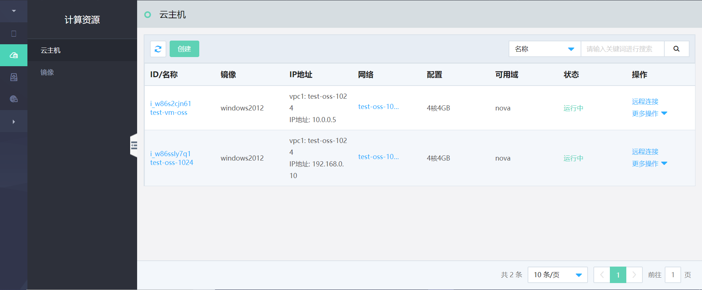

# 云主机

云主机属于京东云敏捷专有云平台的核心组成资源，提供一种处理能力可弹性伸缩的计算服务。云主机是运行在物理节点上的虚拟机计算实例，包含CPU、内存等最基础的计算组件，其管理方式相较于物理服务器更为高效简单。用户可以根据业务需要，随时创建云主机实例、扩容磁盘，在其上运行应用与服务，并通过云主机的独立IP地址访问其上的应用。其他资源，如云硬盘、镜像、安全组等，只有与云主机实例结合后才可以使用。

### 云主机相关功能描述

#### 云主机生命周期管理
京东云敏捷专有云平台的用户可以对权限范围内的所有云主机进行创建、编辑、重启、关机/启动、挂起/恢复、创建镜像、重置密码、重置系统、调整配置、远程连接、挂载/卸载云硬盘、绑定/解绑弹性网卡、绑定/解绑浮动IP、绑定/解绑安全组、删除等全生命周期管理，及查看详情、查看单台云主机监控等常用功能。通过上述操作，用户可以自由灵活的使用云主机服务，并随时根据上层实际业务需求进行调整，减少资源成本，提升使用效率。

#### 云主机访问限制

京东云敏捷专有云平台上云主机可通过安全组设置云主机级别的访问控制策略，用户可以自定义安全组访问规则，有效保障云主机的访问安全。

#### 故障检测与迁移

平台提供云主机和物理节点的常规健康检查功能，用户可以在云管平台查看单台云主机监控信息。针对虚拟机异常情况，可以在运维人员的支持下及时备份业务数据，支持节点故障后云主机的自动疏散，实现服务快速恢复并进行云硬盘的重新挂载。

支持冷迁移、热迁移、灾备迁移某台物理节点上的云主机至其他节点，热迁移过程最大限度保证用户业务不受影响。

#### 云主机镜像

平台支持用户在关机状态下采用制作镜像的方式对云主机中数据进行复制，保证故障发生时能够快速实现云主机恢复。另外，用户也可以根据镜像复制创建新的云主机，从而提高服务效率。

#### 远程VNC

除了通过统一界面实现资源管理与调度，用户也可以采用控制台命令登录每台云主机对其进行管理，无需安装第三方工具，通过Web浏览器即可实现。

#### 云主机监控

通过统一监控系统实现对云主机关键性能指标的抓取与展示，包括CPU使用率、内存使用率、磁盘IOPS与网络流量等，用户可通过独立的监控界面查看其名下每台云主机的监控信息，同时可设置监控查看周期。

#### 安全可控适配

京东云敏捷专有云平台底层可支持安全可控服务器（曙光）、安全可控x86处理器（海光）以及安全可控操作系统（中标麒麟）。