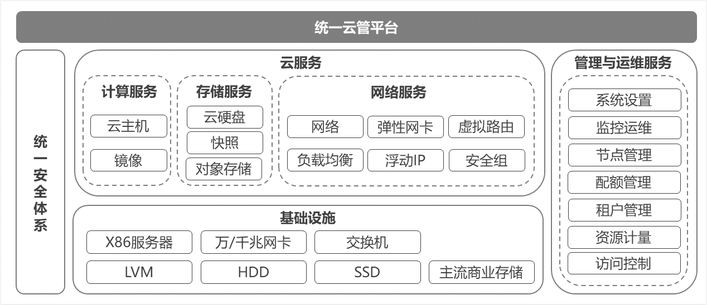

# 云管平台功能介绍

从功能架构上看，京东云敏捷专有云产品主要包括以下组成结构：

### 按节点授权计费

### 基础虚拟化服务

#### 计算服务

采用云主机和镜像资源提供计算服务，支持云主机的创建、编辑、远程连接、挂起/恢复、关机/启动、重启、制作镜像、基于镜像创建、重置密码、重置系统、调整配置、绑定/解绑公网IP、卸载/挂载云硬盘、绑定/解绑弹性网卡、设置安全组、删除等全生命周期管理及查看详情、查看单台云主机监控等常用功能。

#### 存储服务

底层采用分布式存储技术提供块存储和对象存储服务，分布式存储池支持多种硬盘类型。块存储服务支持云硬盘的直接创建、使用快照创建、挂载、升级容量、删除等全生命周期管理及查看详情等常用功能；同时支持云硬盘快照的创建、删除等功能。对象存储服务支持存储空间列表查看与筛选、创建、删除等全生命周期管理及查看详情等常用功能；支持对单个存储空间进行权限管理、对象管理、生命周期规则管理、空间监控等。存储服务支持自动化故障迁移，有效保证数据的安全性与存储的稳定性、可靠性。

#### 网络服务

提供基础的虚拟化网络服务，包括虚拟网络、子网、虚拟路由、弹性网卡和浮动IP、负载均衡等。支持建立私有网络，不同私有网络间逻辑隔离，支持自定义私有网络中子网网段和网关、路由策略、可通过安全组设置云主机级别的访问控制策略，支持独立申请的公网IP地址，支持与云主机、负载均衡等资源进行动态绑定和解绑，支持自定义子网中的负载均衡策略。

### 统一后台管理

#### 用户访问控制

云管平台支持对用户访问的统一身份授权，对于具备不同权限的用户，隐藏未授权功能的菜单项。

#### 组织管理

具有权限的用户在云管平台中可以创建、查看自己的下级组织，最多支持4级组织管理，目前暂不支持对组织的删除操作。

#### 用户管理

云管平台支持具有权限的用户在选中的组织中进行用户创建、重置密码、启用/锁定，管理员对于下级组织中的用户可以进行权限管理，目前版本中修改用户权限、启用和锁定用户都需要等用户重新登录后生效。

#### 配额管理

云管平台支持具有权限的用户查看所在组织以及下级组织的资源配额总量以及剩余可分配配额信息，可将自己组织的配额向下级组织分配，并对已分配出的未使用配额进行回收；支持对本级和下级用户的配额分配与修改。

### 统一运维监控平台

#### 统一监控运维管理

通过统一监控大屏，支持用户查看物理节点的CPU、内存、磁盘使用情况监控，支持物理节点的健康状况和部署服务的存活情况监控，支持存储性能与数据相关监控，支持平台管理面的资源负载与服务存活监控等。同时支持云主机的热迁移、虚拟资源规格的设置、物理主机的信息查看等功能。

#### 告警服务

当前版本暂不支持用户在云管平台上自定义告警规则与告警通知方式，系统自动告警仅针对京东云运维团队，通过订阅的方式实现，包括CPU、内存、磁盘用量超出阈值的告警、服务器宕机与各类服务的停止告警。