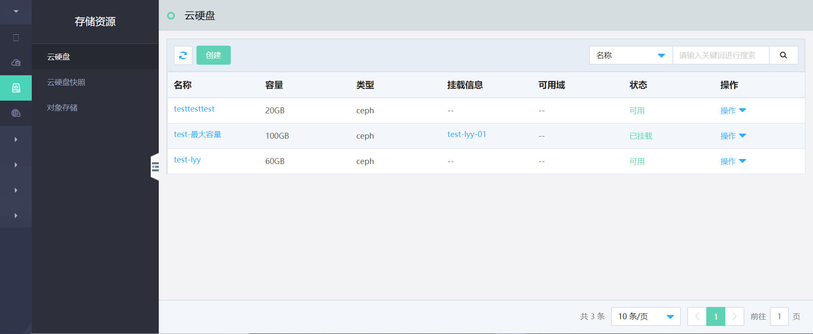

# 云硬盘

云硬盘是京东云敏捷专有云平台提供的高可靠的块存储服务，支持数据多副本分布式存储，分布式存储默认3副本，可避免因组件故障导致数据不可用。云硬盘可以实现云主机系统数据的存储，为云主机运行提供支持；也可以作为数据盘挂载至不同云主机上，持久化存储云主机中的应用数据，支持按需扩展，为多种场景多种业务提供支持。

### 云硬盘相关功能描述

#### 云硬盘生命周期管理
支持通过云管平台实现云硬盘的直接创建、基于快照创建、编辑、从云主机上挂载/卸载、扩展容量、删除等全生命周期管理及查看详情、查看快照等常用功能。通过上述操作，用户可以自由灵活的使用云硬盘服务，并随时根据上层实际业务需求进行调整，减少资源成本，提升使用效率。

#### 独立存储服务

云硬盘提供高可靠、高可用、高性能的数据存储服务，云硬盘中的数据独立于云主机，支持随时挂载和卸载操作，单台云主机支持挂载多块云硬盘，满足用户更高的存储需求。

#### 弹性扩展

平台支持随时按需扩展云硬盘的容量，以满足不同业务的存储需求。基于快照创建云硬盘时，可以为云硬盘配置大于或等于快照容量的存储空间，满足基于快照数据运行业务的诉求，同时可为用户提供更大的存储空间。