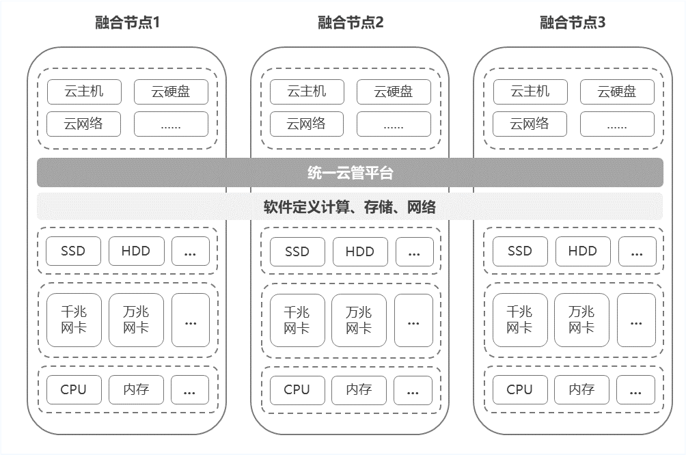

# 基础架构

京东云敏捷专有云超融合版最小支持3节点分布式结构，3节点同时作为控制节点与计算节点，可支持弹性扩展。集群通过统一云管平台，实现对底层硬件设施和上层虚拟化资源的一体化管理，通过SDC、SDS、SDN技术，提供虚拟化计算、存储、网络服务，支持用户对云主机、云硬盘、对象存储、私有网络、负载均衡等虚拟化资源进行管理与使用。

## 部署架构

京东云敏捷专有云超融合版v1.1架构示意如下图：

