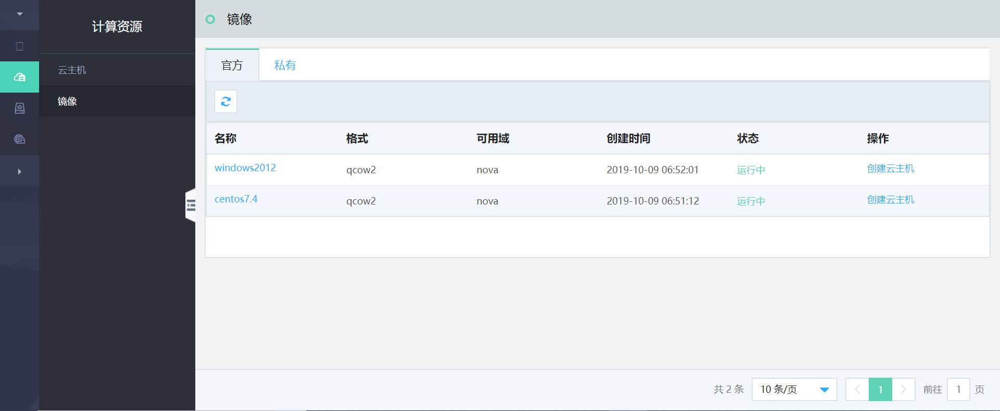
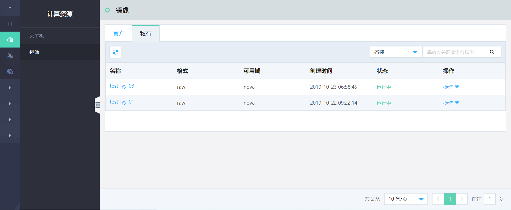

# 镜像 

镜像是云主机所使用的镜像模板文件，包括官方镜像与私有镜像，内含操作系统以及相关配置。用户利用镜像可以实现软件环境的批量部署以及服务器运行环境的备份：

1. 批量部署软件环境：

   对已经部署好环境的云主机自定义制作镜像，然后基于此镜像批量创建云主机，创建之后，拥有和之前云主机一致的软件环境，以此可以达到批量部署软件环境的目的。

2. 服务器运行环境备份：

   对一台云主机制作镜像，如果该云主机在后续使用过程中软件环境被损坏无法正常运行，则可以使用该镜像恢复受损的云主机。

### 镜像相关功能描述

#### 镜像生命周期管理
用户可以在云管平台中实现对私有镜像生命周期的管理，包括私有镜像的创建（基于云主机）、编辑、删除等。

#### 官方与私有镜像支持
云管平台中预置了多种官方镜像，涵盖主流的操作系统镜像，包括Centos7.4、Windows-Server2012等；官方镜像由京东云提供和维护。
平台同时支持用户基于云主机创建私有镜像，私有镜像支持删除和基本信息修改。目前版本暂不支持用户在界面自主上传私有镜像。

#### 基于镜像的云主机创建
用户可以基于平台提供的官方镜像直接创建云主机；也可以基于现有云主机创建的私有镜像，单台或批量创建规格等于或大于该镜像的云主机，适用于软件环境的批量部署等场景。