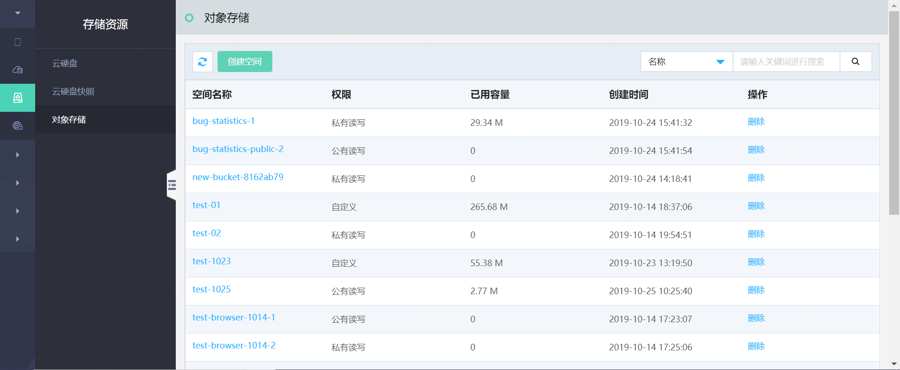

# 对象存储

对象存储是京东云敏捷专有云平台提供的基于对象的安全、稳定、海量、便捷的存储服务，支持数据多副本分布式存储，分布式存储默认3副本，可避免因组件故障导致数据不可用。对象存储为用户提供了超大存储容量的能力，适合存放任意类型的文件，基于AK/SK对用户进行访问控制，用户可以在云管平台上或使用第三方工具轻松管理自己存储在对象存储上的数据，以及开发多种类型的上层业务应用。

### 对象存储相关功能描述

#### 生命周期管理
支持用户通过云管平台实现对存储空间的创建、删除等全生命周期管理及查看详情等常用功能。另外，用户可以通过设置空间生命周期规则，进行空间内对象的生命周期管理，自动删除整个存储空间内的过期对象或指定前缀的对象，无需用户手动维护数据的生命周期，从而减少存储空间在使用中的维护时间与维护成本，提高空间利用率。

#### 对象管理
支持用户通过云管平台在单个存储空间内进行对象的管理，包括新建/删除文件夹、对象列表查看与筛选、上传/下载/删除对象、获取对象外链、分片管理、对象详情查看等常用功能，以满足用户各个场景的需求。

#### 访问权限设置
平台支持对每个存储空间进行灵活的权限控制，通过云管平台，用户可以在创建存储空间的同时定义该空间的访问权限，也可以在创建后修改权限，目前支持三种访问权限：公有读写、私有读写和公有读私有写。

#### 跨域访问设置
平台支持跨域资源共享，基于W3C标准化组织提出的跨域访问验证机制CORS，支持一个域中加载的客户端Web 应用程序对另一个域中资源的访问，增强跨域数据传输的安全性。用户可以通过在云管平台上添加CORS规则，设置允许跨域请求的来源与请求方式等，实现跨域资源共享。

#### 存储空间监控
平台通过统一监控系统实现对存储空间的存储情况、流量统计、请求次数等指标的监控。用户可通过独立的监控界面查看其名下每个存储空间的监控信息，同时可设置监控查看周期。方便用户及时了解目前资源的使用状况、并合理规划使用计划。