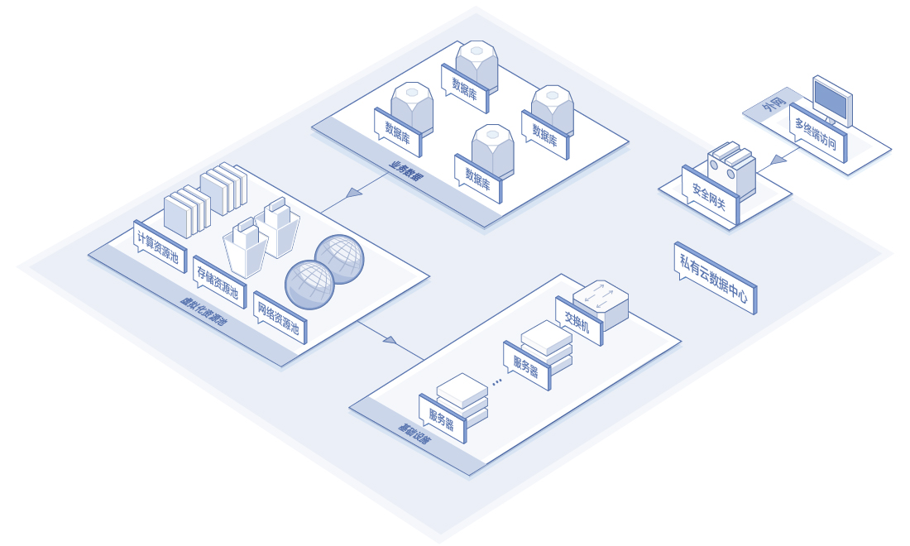
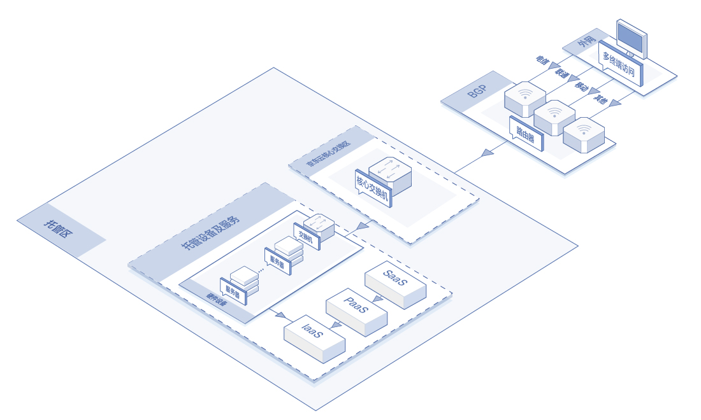
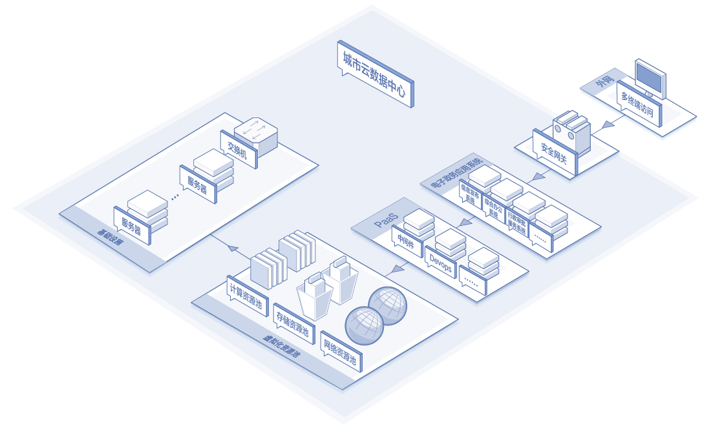
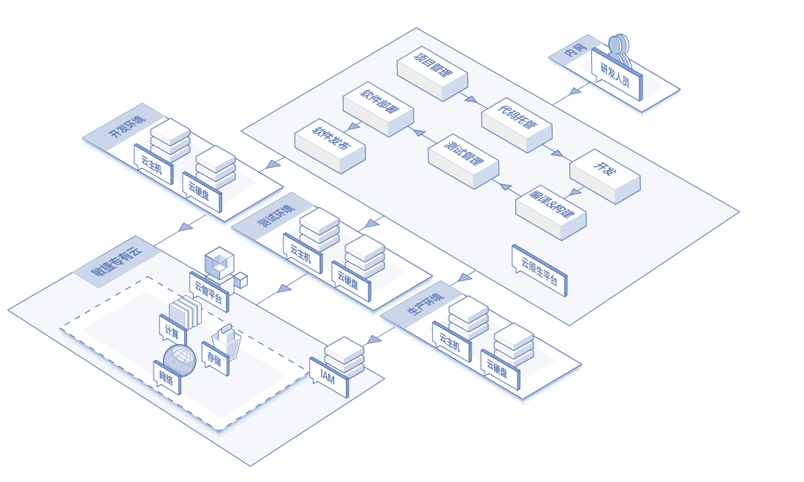

# 应用场景

### 私有云数据中心

传统数据中心资源固化、灵活性差，运维成本居高不下，资源管理不便。敏捷专有云平台以软件定义的IT架构实现计算、存储、网络的全虚拟化资源池，并支持用户对现有数据中心中的硬件资源进行利旧，实现优化投资。平台以新的IT架构为基础，建立新一代私有云数据中心，实现资源无缝横向扩展，提高数据安全性与可靠性。支持企业将IT资源转变为服务快速推送给用户，并允许用户通过网络，方便灵活地访问可配置计算的资源共享池，以最小的管理代价和工作量实现数据资源的合理化发布。同时，可应用统一身份认证、用户等级制度、数据容灾备份及数字加密等技术，有效保证企业信息资源的安全性，避免了企业内部信息资源在公有云资源池中受到的安全威胁。

### 云服务托管

越来越多的企业、单位，既想拥有利用公有云按需使用、弹性伸缩的特性来减少成本支出，又希望利用私有网络环境隔离的特性，为业务提供更好的数据保护。平台支持用户服务器在京东自营机房托管，同时享有现场运维服务，为用户定制最佳解决方案，满足个性化的业务需求。云服务托管兼具公有云和私有云的优势，同时为用户在运维管理与运营管控方面赋能。

### 城市云
当今政府为促进地区经济与技术快速发展设立众多产业基地，为大力支持这种场景，京东云提供一种城市云解决方案，助力提升多个城市产业基地的信息系统承载能力。利用当地数据中心的服务器与其他硬件资源，以新的软件定义IT架构为基础搭建敏捷专有云平台，上层可搭载数据库、中间件等通用的基础软件资源，支持外部用户共享PaaS层资源。同时基于PaaS平台，支持各产业应用的开发、测试和生产集成，与政府部门共同打造新一代城市云技术服务平台。

### 云原生

传统应用系统的搭建或改造，需要大量投入IT资源，成本高、业务上线和改造周期长，后期扩展较复杂。敏捷专有云平台提供敏捷基础设施，支持基于微服务架构与DevOps等技术，实现应用程序的动态编排、按需伸缩、主动调度和管理，提高应用程序的整体灵活性和可维护性，从而优化资源利用率，使得用户交付团队可以使用可重复的自动化和编排来快速迭代。企业利用云原生，可以实现更快的应用上线速度、细致的故障探测和发现、故障自动隔离、故障自动恢复、横向弹性扩容等诉求，让应用和基础设施的部署和故障修复更加快速和敏捷，极大的降低企业在云计算方面的部署成本，帮助企业实现数字化转型。

