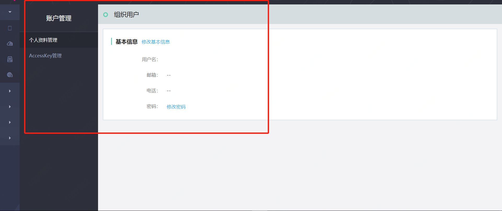

# 账户管理

## 个人资料管理

平台支持用户对其个人资料的管理，用户可查看用户名、角色、姓名、邮箱、电话、注册时间、密码等信息，同时可编辑姓名、邮箱与电话，支持重置登录密码。

## AccessKey管理

AccessKey 由 AccessKeyId 与 SecretAccessKey 组成，AccessKeyId（AK）与 SecretAccessKey（SK）是用户访问京东云敏捷专有云平台对象存储的身份标识，拥有同一AK/SK的任何人均具有相同的资源访问和操作权限。平台支持对AK/SK的管理，用户可以对其AK/SK执行创建、删除的操作。

