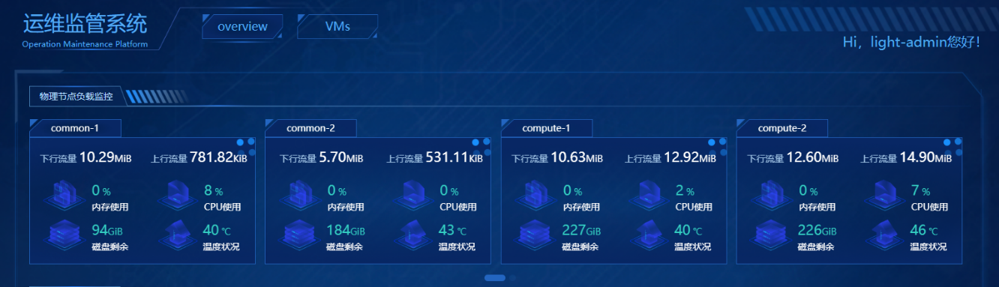
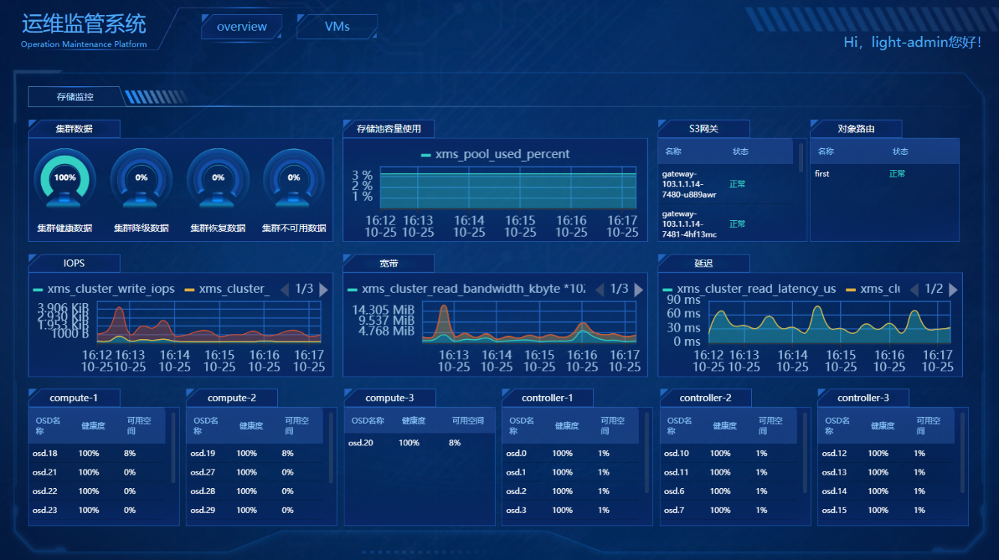

# 运维监控

京东云敏捷专有云平台支持用户查看整个集群的CPU、内存、磁盘使用情况监控，支持物理节点的健康状况和资源使用情况监控，支持控制服务健康状况的监控，支持虚拟资源、主机集合和可用域的管理功能。同时由京东云专业的运维团队统一管理平台告警与日志信息，为用户提供全方位的运维支持。

## 资源监控

京东云敏捷专有云平台的资源监控主要分为两个部分：

* 云主机监控：

普通用户可查看其权限内可以使用云主机资源的监控信息，包括CPU使用率、内存使用率、磁盘读/写吞吐量与网络进/出速率等，以便及时了解云主机的运行与性能情况，对于异常现象能够及时发现，根据实际运行状况合理规划资源的使用。平台支持用户自选监控周期查看云主机性能。

* 平台整体资源监控：

平台的系统管理员和运维角色具有查看该部分的权限，整体资源监控主要包括物理节点的负载监控（CPU、内存、磁盘容量等）、全部类型物理节点上的服务存活监控、存储性能与数据相关监控、平台管理面的资源负载与服务存活监控等。

### 物理节点负载监控

平台支持对每个物理节点的负载情况进行监控，主要包括CPU、内存、磁盘、网络、温度相关指标。通过对物理节点进行多维度监控，平台运维人员可以根据实际情况进行资源调度策略调整，避免服务器发生过载情况，从而保证上层业务应用可以对外提供稳定的服务。

### 物理节点服务存活监控

平台部署了多种服务，为平台提供底层支撑，包括计算服务、存储服务、网络服务等。平台运维角色可以查看每个节点上部署的全部服务的监控状态，在故障发生后快速定位问题，便于后续问题的排查。

### 存储性能与数据相关监控

平台支持对底层分布式存储系统的监控，主要包括存储性能、存储数据健康度、存储池容量使用情况、每块存储盘健康状况与可用容量等。运维角色可以通过这部分信息及时了解存储盘与存储数据的监控情况，便于快速定位问题。

### 平台管理面监控

京东云敏捷专有云平台可以对平台管理面的虚拟机进行监控，包含每台虚拟机CPU、内存、磁盘使用情况、网络流量、虚拟机上部署服务的存活状况等。运维角色可以根据监控信息及时发现虚拟机故障问题，快速定位。

### 虚拟机监控

平台支持对其上管理面虚拟机、用户云主机资源的监控，主要包括虚拟机运行状态、CPU使用率、内存使用率、磁盘IO、网络上下行速度等。

## 虚拟资产管理

虚拟资产管理使得系统管理员和运维角色可以查看、管理整个平台的所有虚拟资源，当前版本仅支持对于虚拟计算资源（云主机）的统一运维管理，包括列表查看与筛选、远程连接、编辑、创建镜像、关机/启动、热迁移至另一物理节点、重启、删除等操作。

## 物理资产管理

平台支持系统管理员和运维角色对全部物理资产的查看，主要为主机节点的启动状态与服务状态查看，实现对平台物理资源的总体管控。

