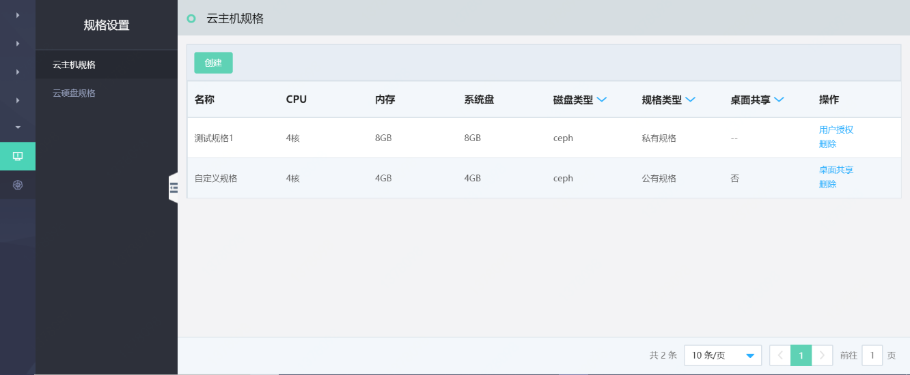
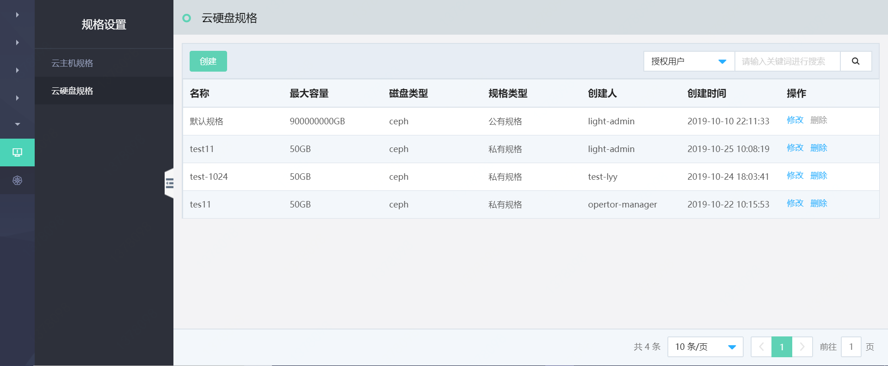
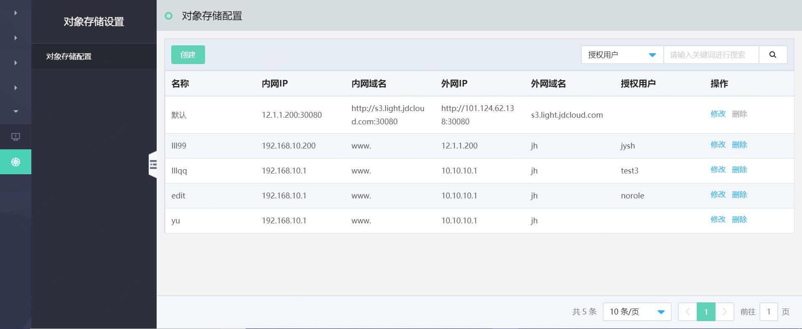

# 系统设置

## 规格设置

系统管理员、运维管理员和运维人员可以通过规格设置对平台中云主机、云硬盘的规格进行统一配置、统一管理。

### 云主机规格

支持用户创建、管理不同的云主机规格配置，设置不同的CPU、内存、系统盘容量、系统盘类型等；同时支持为每条云主机规格进行用户授权，可选择设置公有、私有两种类型的规格，公有规格对所有用户可见，私有规格可指定对某些用户可见。同一用户可以被授权多个云主机规格，以便普通用户快速选择适用的云主机规格，充分满足不同的业务应用系统对计算资源的需求。

### 云硬盘规格

支持用户按需配置多种云硬盘规格，对云硬盘最大容量、硬盘类型进行管理，满足多种业务场景需求。用户可自定义私有规格，并指定对部分用户可见；平台预置一条不可删除的云硬盘公有规格，对所有未指定私有云硬盘规格的用户可见。每个用户只可分配一条云硬盘规格，在创建或扩容云硬盘时，所选择的最大容量不可超过该规格设置。

## 对象存储设置

支持用户对对象存储的内外网访问域名与访问IP进行配置，同时支持为每条新创建的对象存储配置进行用户授权。平台预置一条默认配置，对全部用户开放，该条配置仅支持修改，不可删除。

