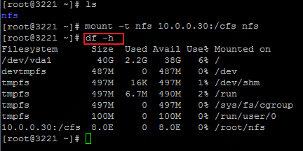

# 挂载文件存储

1.在京东云主机实例中挂载文件存储，首先需要登录到您的云主机实例终端，可参阅：[登录linux实例](https://docs.jdcloud.com/cn/virtual-machines/connect-to-linux-instance)

2.安装utils客户端：

在CentOS 的终端下，运行如下命令:

`sudo yum install –y nfs-utils`

在Ubuntu系统的终端下，运行如下命令：

`sudo apt-get install nfs-common`

3.创建目录，如创建名为nfs的目录：

`sudo mkdir nfs`

Ubuntu系统运行如下命令：
`mkdir nfs`

4.通过挂载目标的IP地址挂载文件存储，挂载目标的IP地址可在“控制台-存储与CDN-云文件服务-文件存储”页面，点击该文件存储的ID后查看。

如，挂载目标的目录为10.0.0.30:/cfs，挂载到上一步创建的nfs目录。**注意，挂载命令默认NFS协议为4.0版本，建议以NFS v3版本挂载。挂载时也可以根据对版本、性能和一致性的不同要求增加相应参数，请见文末说明**

`mount -t nfs -o vers=3 -o noresvport 10.0.0.30:/cfs nfs`

在Ubuntu系统的终端下，运行如下命令：

`mount -t nfs -o noresvport 10.0.0.30:/cfs nfs`

5.通过运行以下命令，验证是否挂载成功：

`df -h`

挂载成功后会出现“Filesystem”为挂载目标IP:/cfs，“Mounted on”为上一步指定目录的记录。

**注意**

1. 云文件服务暂不支持使用传输中的数据加密，即不支持使用以下命令挂载文件系统。

mount -t nfs -o tls 10.0.0.30:/cfs nfs

2. 挂载文件存储时，挂载选项的默认值如下，大多数情况下，请避免修改默认的参数值，以免对性能或稳定性造成影响：
- -o lookupcache=all : 设置是否缓存文件存储上的目录，可取值为： all,none,pos。默认为all，即相信缓存中的数据。当取值为none时，即不缓存目录，有利于不同节点同时挂载文件存储时的数据一致性，但影响readdir操作的性能；取值为pos（或positive）时，nfs客户端会在读取时对cache进行验证。
- -o ac ： 设置是否缓存文件的属性数据。默认为ac，即缓存文件属性。当设置为noac时，有利于不同节点同事挂载文件存储时的数据一致性，但影响文件读取的性能。
- rw：以可读写模式挂载。 当设置为 -ro时，以只读模式挂载。
- relatime：访问文件时，仅在 atime 早于文件的更改时间时对 atime 进行更新。
- vers=3：NFS协议版本为3.0
- rsize=1048576 ：设置 NFS 客户端对每个网络 READ 请求可以接收的数据最大字节数。在从文件存储上的文件读取数据时应用此值。默认设为最大值：1048576。
- wsize=1048576：设置 NFS 客户端对每个网络 WRITE 请求可以发送的数据最大字节数。在从文件存储上的文件读取数据时应用此值。默认设为最大值：1048576。
- namlen=255：设定远程服务器所允许的最长文件名为255字节。
- hard：设置 NFS 客户端在 NFS 请求超时之后的恢复行为，设置为hard时，NFS 请求在服务器回复之前会持续重试。为确保数据完整性，建议使用硬挂载选项(hard)。
- proto=tcp：使用TCP协议挂载。
- timeo=600：NFS请求重试的等待响应时间，此处默认设为600分秒（60秒）。过小的timeo参数值可能引起性能下降。
- retrans=2：NFS客户端重试请求次数，此处默认设为2次。
- noresvport：NFS 客户端在每次重新建立网络连接时，使用新的传输控制协议 (TCP) 源端口。有助于确保 CFS 文件系统在网络恢复事件后具有不间断的可用性。

# 配置自动挂载

1. 通过编辑 /etc/fstab 文件，实现在Linux系统中对CFS文件系统的自动挂载。执行
  `vi /etc/fstab`

2. 按下 "i"键，进入编辑模式。在该文档的最后一行加入如下字符：

   `10.0.0.66:/cfs /mnt nfs nfsvers=3,noresvport,_netdev 0 0`

  其中：
   `10.0.0.66:/cfs` 是文件存储的挂载目标地址，请替换为您所需挂载的文件存储挂载目标地址；
  `/mnt`是希望挂载至的位置，可根据需要替换；
  `nfsvers=3`是指定以nfs v3版本协议挂载。当前建议以此版本挂载，以规避一些NFS客户端已知问题。如需nfs v4版本，可替换为：`nfsvers=4.0`
  `noresvport`有助于确保CFS 文件系统在网络恢复事件后具有不间断的可用性。
  `_netdev`确保网络就绪后进行nfs mount操作，降低自动挂载失败风险。
  
3. 按下"ESC"键，再输入"wq"（保存并退出），回车后，即更新了fstab配置文件，完成自动挂载配置。此时可以umount 当前的文件存储，并执行 `mount -a` 来检查配置是否成功。 
