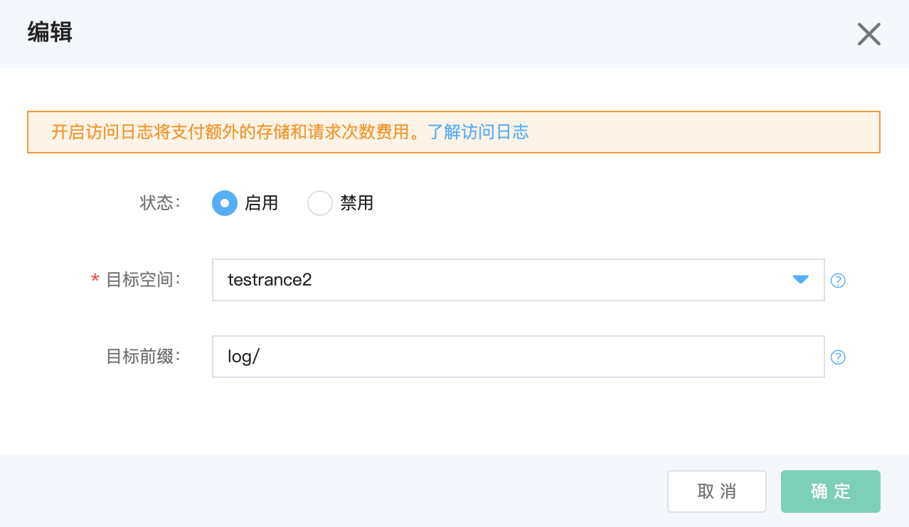

# 访问日志

服务器访问日志可记录对bucket的详细请求，以便根据日志进行账单审计、访问分析、权限审核等。

## 使用控制台开启访问日志功能

1.登入控制台->对象存储->空间管理->进入某个Bucket->基础设置->访问日志

2.单击**编辑**按钮，打开访问日志配置对话框。



3.点击**启用**，输入目标空间和目标前缀，再点击**确认**后即开启访问日志。

细节说明：

* 源bucket和目标bucket必须位于同一区域，所属同一账号。

* 输入前缀不能超过 1022 个字节，不能包含反斜杠（\）或双斜杠（//）。

* 关于计费：控制台启用日志操作、日志输出到bucket均产生请求次数，按照请求次数计费规则收费。产生的日志文件占用存储空间，按照标准存储容量计费规则收费。

* 修改目标bucket有一定时间的延迟，如果将日志记录的目标bucket从Bucket A更改为Bucket B，则在接下来的一个小时里仍可能有一些日志传输到Bucket A，但其他日志会传输到Bucket B。

* 在某一时刻产生的日志，可能包括这一时间前的任何时间的记录。无法得知某一特定时间段的日志是否都已经生成了。

* 最大努力原则：访问日志服务将尽最大努力记录并输出bucket的所有请求，但不能保证每个请求都可以得到记录。

* 不建议将目标bucket设置为源bucket，因为输出日志的请求本身也会产生日志，这样做会无限循环的一直输出日志。

## 日志格式

日志文件将存储在目标bucket的以下位置：

```
TargetPrefixYYYY-mm-DD-HH-MM-SS-UniqueString/
```

其中，TargetPrefix是开启访问日志功能时指定的目标前缀。

YYYY、mm、DD、HH、MM和SS分别对应产生日志的年份、月份、日期、小时、分钟和秒。该时间为UTC时间，北京时间需要+8小时。

UniqueString字段是为了防止重复，本身没有意义。

下面是一个日志示例：

```
916189066405 test-logging [05/Jun/2020:10:40:43 +0000] 103.226.192.8 916189066405 9E44C68D401D740D REST.POST.BUCKET testObject "POST / HTTP/1.0" 204 - - 1025 23 23 "-" "Apache-HttpClient/4.5 (Java/1.8.0_181)" - c3RhZzItcjItYXoxOjoxMC4yMjYuMjAxLjE4MA== - - - test-logging.s3.cn-north-1.jdcloud-oss.com -
```
各字段详解见表格：

|名称|示例|详解|
|:-|:-|:-|
|用户ID|916189066405|bucket所属账号的account ID|
|空间名|test-logging|空间名称|
|时间|06/Feb/2019:00:00:38 +0000|使用UTC时间，北京时间需要在此时间上+8小时|
|请求IP|103.226.192.8|HTTP请求头中x-forwarded-for字段的第一个IP|
|请求者|916189066405|请求者的京东智联云account ID|
|请求ID|9E44C68D401D740D|request ID，每个请求不重复，用于唯一标识请求|
|操作|REST.POST.BUCKET|该请求的操作种类|
|key|test/object.txt|请求的文件名|
|请求URI|POST / HTTP/1.0|HTTP请求中的request URI|
|HTTP状态码|204|HTTP状态码|
|错误码|NoSuchBucket|对象存储的错误码|
|响应大小|243565|响应的总大小，单位：字节|
|文件大小|243485|请求文件的大小，单位：字节|
|总时间|23|服务端收到请求的第一个字节到发出响应最后一个字节的时间。单位：毫秒|
|处理时间|23|服务端收到请求的最后一个字节到发出响应的第一个字节的时间。单位：毫秒|
|Referer|https://www.jdcloud.com/|HTTP请求头中的Referer|
|User-Agent|Apache-HttpClient/4.5 (Java/1.8.0_181)|HTTP请求中的User-Agent|
|版本ID|asdfqregha|object的版本号|
|扩展请求ID|c3RhZzItcjItYXoxOjoxMC4yMjYuMjAxLjE4MA==|用于唯一标识请求|
|签名版本|SigV4|aws签名版本|
|加密套件|ECDHE-RSA-AES128-GCM-SHA256|HTTP加密方法|
|身份验证类型|AuthHeader|身份验证方法|
|HOST|test-logging.s3.cn-north-1.jdcloud-oss.com|请求域名|
|TLS版本|TLSv1.2|TLS版本|
