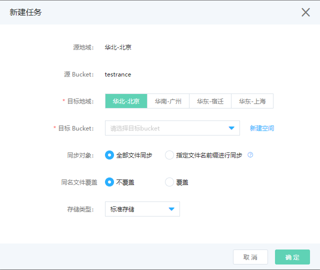

# 历史数据同步设置 

使用历史数据同步可以将原Bucket的现有文件一次性复制到目标Bucket，以完成数据迁移或者实现跨区域和同区域容灾。

## 使用场景

历史数据同步与[增量数据同步](../../Operation-Guide/Manage-Bucket/Set-Bucket-Cross-Region-Replication-2.md)配合使用，可以实现以下需求：

* 数据复制：由于业务原因，需要将数据从一个空间迁移至另一个空间。

* 合规性要求：合规性要求所规定的数据需要跨一定距离保存一份副本。

* 数据备份与容灾：如果您对所有写入的数据都希望在异地存储区域维护一份副本，以备发生如海啸、地震等特大灾难导致存储区域损毁时，还能启用异地存储区域的备份数据。

* 最大限度减少延迟：用户处于两个地理位置。为了最大限度缩短访问对象时的延迟，可以在地理位置与用户较近的存储区域维护对象副本。

## 使用控制台新建历史数据同步任务

1.登入控制台->对象存储->空间管理->进入某个Bucket->高级设置，导航至“数据同步->历史数据同步”功能区域。

2.单击 新建任务，打开历史数据同步规则配置对话框。

3.选择目标存储空间所在的地域及存储空间名称。

4.选择同步对象。

* 全部文件进行同步：将源存储空间内所有的文件同步到目标存储空间。

* 指定文件名前缀进行同步：将源存储空间内指定前缀的文件同步到目标存储空间。

   a.  您最多可以添加1000个前缀。每条前缀最多1022字节。

   b.  文件前缀不支持重叠前缀，例如test与test/01是不容许的。
   

5.选择覆盖或不覆盖。  

* 当目标空间存在与源空间同名的文件时，可以控制是否做覆盖。 
  

6.选择存储类型。

* 目前支持标准存储、低频存储、归档存储和低冗余存储（不推荐）。

7.点击 执行，开始同步。

## 查看历史数据同步任务

登入控制台->对象存储->空间管理->进入某个Bucket->高级设置，导航至“数据同步->历史数据同步”功能区域。

创建任务后，可以在历史数据同步列表中查看任务进度和状态，并进行取消任务等操作。

说明：

* 与增量数据同步的区别：增量数据同步是一种空间的属性，开启后符合要求的文件自动同步到另一空间。而历史数据同步是一种任务，任务创建后只会执行一次，执行完成后就不能重启。

* 新建的任务为初始化状态，如果往初始化状态的源空间中上传新的文件，则该文件不一定能够同步到目标空间。

* 历史数据同步任务可以取消，但取消后就不能重启，取消时已经被同步的文件也不会删除。
