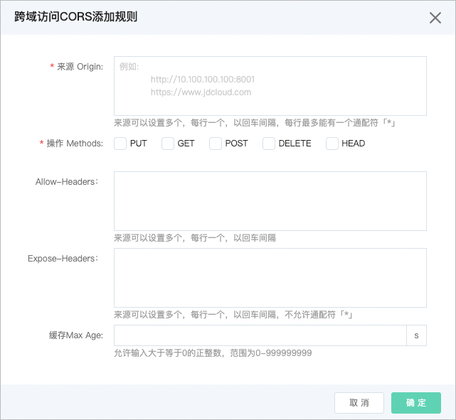
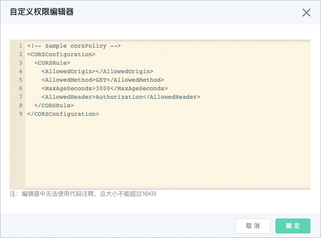

# 跨域访问设置

跨源资源共享 CORS（Cross-Origin Resource Sharing）提供设置文件跨域访问的方法。

## 使用场景 

当一个请求URL的协议、域名、端口三者之间任意一与当前页面地址不同即为跨域。假设在http://www.jdcloud.com/cors.html 页面需要请求其他资源，则跨域许可检测情况如下：

URL|是否需要跨域许可|原因
--|--|--
http://www.jdcloud.com/other.html |不需要，可直接请求|协议、域名、端口相同
https://www.jdcloud.com/other.html |需要|请求协议不同（HTTPS）
https://www.jdcloud.com:22/other.html |需要|端口不同（22）
http://test.jdcloud.com/other.html |需要|域名不同

较为常见的需要跨域许可的情况有以下几种场景：

1.调用XMLHttpRequest或FetchAPI通过跨站点方式访问资源；

2.Web字体，通过CSS使用@font-face 跨域调用字体（OSS托管Web字体，在浏览器加载时要求预检）；

3.通过canvas标签，绘制图表和视频；

## 在控制台中设置过程如下：

1.登入控制台->对象存储->空间管理->进入某个Bucket->权限设置，可对“跨域访问设置”进行操作。

2.在“跨域访问设置”功能区域，下方是CORS规则列表，默认每个Bucket最多支持10条规则。规则列表的各字段说明如下：

**来源Allowed Origin**：允许跨域请求的来源。

- 来源可以设置多个，每行一个。

- 支持单个具体域名，例如http://www.jdcloud.com

- 支持二级以上泛域名，但每行只能有一个* 号。例如http://* .jdcloud.com。

- http:// 或 https:// 必须携带。

- 支持设置为IP（可以是IPv4或IPv6），但不推荐。

- 支持在域名或IP后加端口号。

**Allowed Method**：按照需求开通对应的方法即可，如GET、PUT、POST、HEAD、DELETE，可以全选。

**Allowed Headers**：允许的跨域请求header。

- 可以配置多条匹配规则，以回车间隔。

- 在Access-Control-Request-Headers中指定的每个header，都必须在Allowed Header中有对应项。

- Header容易遗漏，没有特殊需求的情况下，建议设置为* ，表示允许所有。

- 大小写敏感。

- 当CORS规则列表页中同一个规则内当有多条记录时换行展示时，不做缩略处理，每行记录如果超出列宽限制，后缀以...展示。

**Exposed Headers**：暴露给浏览器的header列表，即用户从应用程序中访问的响应头。不允许使用通配符。具体的配置需要根据应用的需求确定，只暴露需要使用的header。如果不需要暴露可以不填。该项是可选配置项。当CORS规则列表页中同一个规则内有多条记录时换行展示时，不做缩略处理，每行记录如果超出列宽限制，后缀以...展示。

**缓存Max Age**：浏览器对特定资源的预取请求（OPTIONS请求）返回结果的缓存时间，单位为秒。如果没有特殊情况可以稍大一点，比如600秒。只允许输入大于等于0的正整数，范围为0-999999999。该项是可选配置项。

3.添加CORS规则：在跨域访问CORS规则列表上方，可通过点击“CORS规则设置”按钮来添加CORS规则，效果如下：

4.还可以通过点击“CORS规则编辑器”来自定义CORS规则，效果如下：

## 跨域规则详解

跨域资源共享（Cross-Origin Resource Sharing），简称CORS，是HTML5提供的标准跨域解决方案，服务端对于跨域请求的处理流程如下：

1.CORS通过HTTP请求中附带Origin的Header来表明自己来源域，服务器端接收到这个请求之后，首先检查HTTP头部有无Origin字段，如果HTTP头部没有Origin，或者不允许，直接当成普通请求处理，处理结束。

2.如果HTTP头有Origin并且是允许的，服务器在返回的响应中会附带上Access-Control-Allow-Origin这个Header。

3.浏览器根据是否返回了对应的Header来决定该跨域请求是否成功，如果没有附加对应的Header，浏览器将会拦截该请求；此外，还要判断该请求是一个简单请求还是一个预请求（Preflighted Request），如果不是简单请求，浏览器并不会立即执行对应的请求代码，而是会先发送Preflighted Request（预先验证请求），Preflighted Request是一个OPTION请求，用于询问要被跨域访问的服务器，是否允许当前域名下的页面发送跨域的请求。OPTIONS请求头部中会包含以下头部：Origin、Access-Control-Request-Method、Access-Control-Request-Headers。服务器收到OPTIONS请求后，设置Access-Control-Allow-Origin、Access-Control-Allow-Method、Access-Control-Allow-Headers头部与浏览器沟通来判断是否允许这个请求。如果Preflighted Request验证通过，浏览器才会发送真正的跨域请求。否则，浏览器会拦截接下来的请求。

4.如果服务器允许所有的跨域请求，将Access-Control-Allow-Origin的Header设置为* 即可，但不推荐。

5.CORS规则匹配成功必须满足三个条件，首先，请求的Origin必须匹配一项AllowedOrigin项，其次，请求的方法（如GET，PUT等）或者OPTIONS请求的Access-Control-Request-Method头对应的方法必须匹配一项AllowedMethod项，最后，OPTIONS请求的Access-Control-Request-Headers头包含的每个Header都必须匹配一项AllowedHeader项。

### 细节分析

1.CORS相关的Header附加等都是浏览器自动完成的，用户不需要有任何额外的操作，CORS请求与对象存储的身份验证是完全独立的，即CORS规则仅仅是用来决定是否附加CORS相关的Header的一个规则，是否拦截该请求完全由浏览器决定。

2.使用跨域请求的时候需要关注浏览器是否开启了Cache功能。当运行在同一个浏览器上分别来源于www.example1.com和www.example2.com 的两个页面都同时请求同一个跨域资源的时候，如果www.example1.com 的请求先到达服务器，服务器将资源带上Access-Control-Allow-Origin的Header为www.example1.com 返回给用户。这个时候www.example2.com 又发起了请求，浏览器会将Cache的上一次请求返回给用户，此时Header的内容和CORS的要求不匹配，就会导致后面的请求失败。
