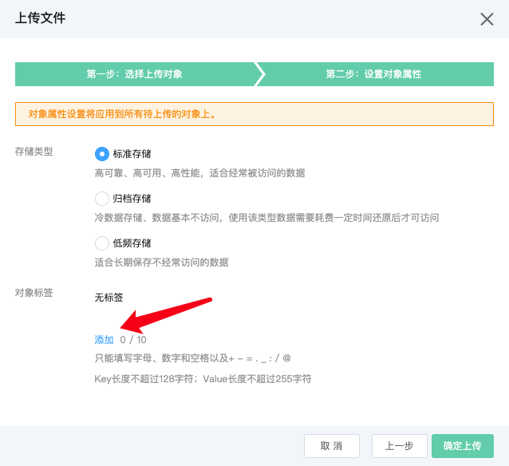
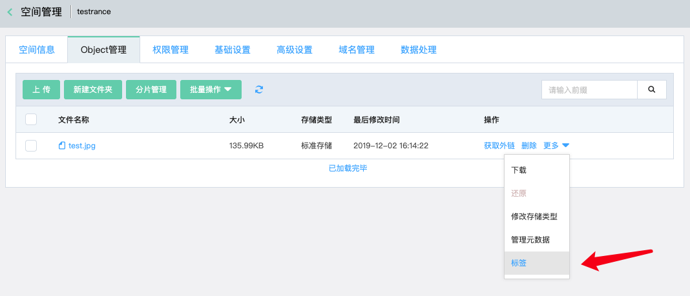
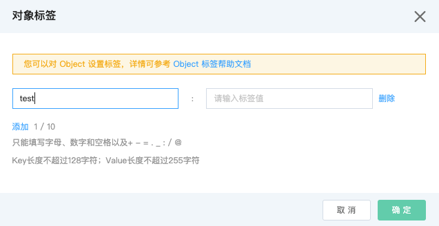

# 对象标签

用户可以使用对象标签来对文件进行分类。通过标签，可以控制文件生命周期和访问权限的范围。

## 规则限制

* 单个文件最多可设置10个标签，标签键不可重复。

* 标签键长度不可超过128字符，标签值长度不可超过256字符。

* 可以只有标签键，没有标签值，也可以标签键和标签值都存在。但不能只有标签值，没有标签键。

* 标签键和标签值均区分大小写。

* 标签键值可以使用UTF-8表示的字母、数字、空格和这些字符：+ - = . _ : / @

## 控制台上传文件添加对象标签

1. 登入对象存储控制台。

2. 在**上传文件**操作中，进行第二步**设置对象属性**时，可以对文件添加对象标签：

3. 点击**添加**，可输入标签键和标签值。

## 控制台对已有文件添加标签

1. 登入控制台->对象存储->空间管理->进入某个Bucket->Object管理->某个文件->更多->标签：

2.点击**标签**，可以对该文件添加对象标签：

