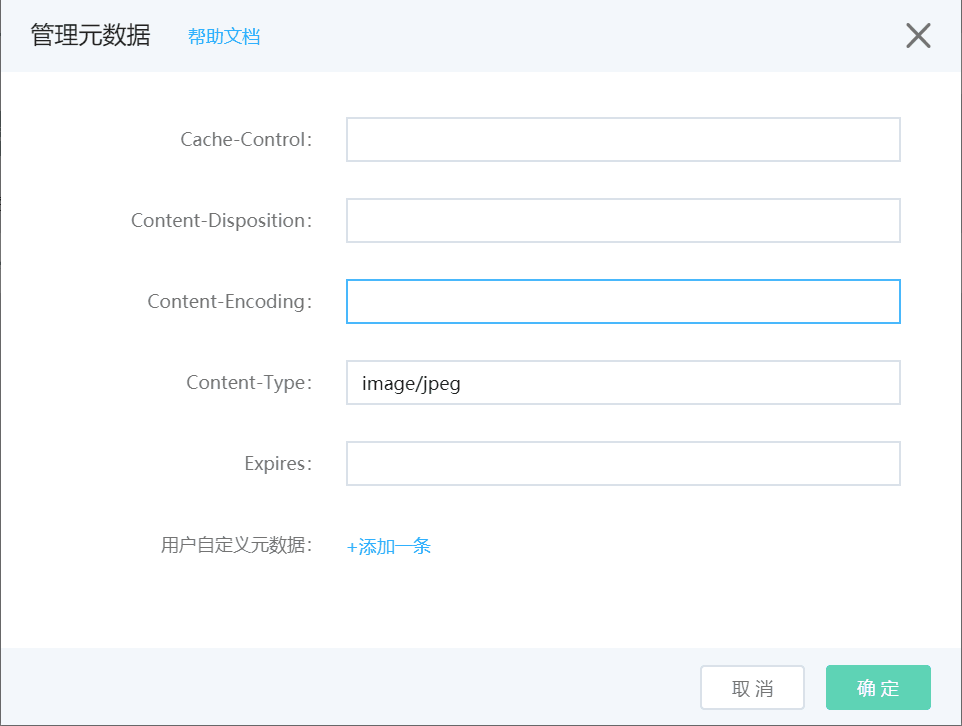

# 管理元数据

管理元数据功能可以修改文件的HTTP响应头，实现控制客户端缓存时间、文件强制下载等策略。除一些通用响应头外，还支持配置自定义元数据。

## 控制台配置

1.登入控制台->对象存储->空间管理->进入某个Bucket->某一文件->更多->管理元数据

2.元数据配置对话框如图：

## 支持的元数据列表

名称|描述|备注
---|---|---
Cache-Control|[RFC2616](https://www.ietf.org/rfc/rfc2616.txt?spm=a2c4g.11186623.2.9.5b613bdb255OGR&file=rfc2616.txt)中定义的缓存规则控制。|Cache-Control的值不能超过30个字符。
Content-Disposition|[RFC2616](https://www.ietf.org/rfc/rfc2616.txt?spm=a2c4g.11186623.2.9.5b613bdb255OGR&file=rfc2616.txt)中定义的默认文件名响应头。可控制文件强制下载|Content-Disposition的值不能超过100个字符。
Content-Encoding|[RFC2616](https://www.ietf.org/rfc/rfc2616.txt?spm=a2c4g.11186623.2.9.5b613bdb255OGR&file=rfc2616.txt)中定义的文件编码响应头。|Content-Encoding的值不能超过20个字符。
Content-Type|[RFC2616](https://www.ietf.org/rfc/rfc2616.txt?spm=a2c4g.11186623.2.9.5b613bdb255OGR&file=rfc2616.txt)中定义的请求内容类型。|Content-Type的值不能超过128个字符。
Expires|[RFC2616](https://www.ietf.org/rfc/rfc2616.txt?spm=a2c4g.11186623.2.9.5b613bdb255OGR&file=rfc2616.txt)中定义的过期时间。|支持Unix时间戳、GMT、ISO8601三种格式。 
x-amz-meta-\*|可自行指定键值的自定义元数据|自定义元数据的键值相加不能超过2KB。

* 细节说明：默认元数据的值，需要满足[RFC2616](https://www.ietf.org/rfc/rfc2616.txt?spm=a2c4g.11186623.2.9.5b613bdb255OGR&file=rfc2616.txt)的标准。
