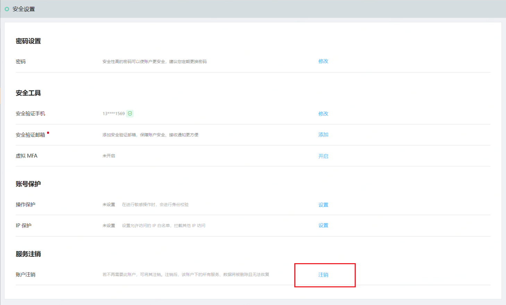
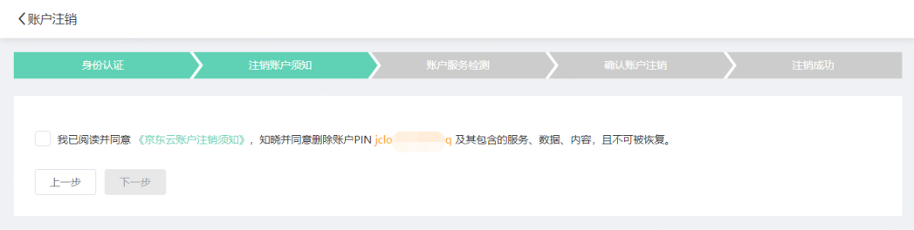
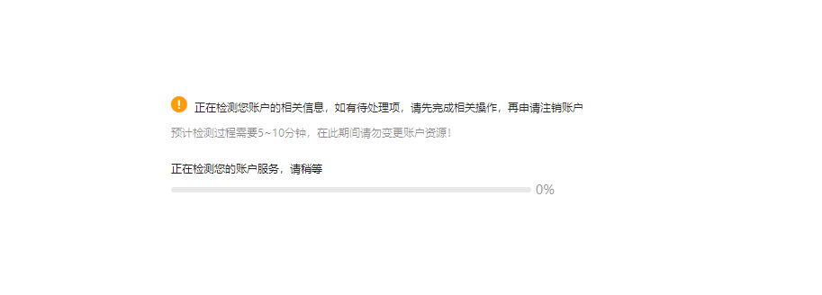
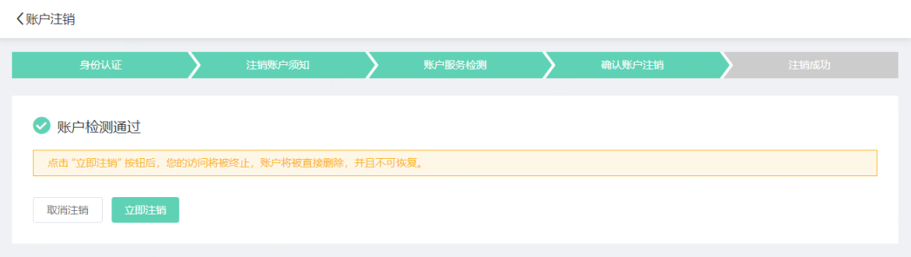
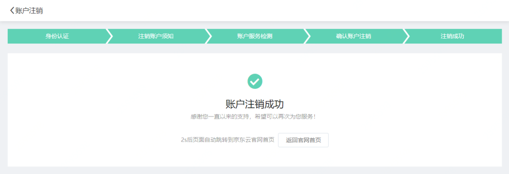

# 账号注销
**请确保您在申请账号注销前，已阅读、知晓并同意[《京东云账户注销须知》](https://docs.jdcloud.com/cn/account-management/account-revocation-notice)及[《京东云隐私政策》附件](https://docs.jdcloud.com/cn/platform-agreement/privacy-policy)。如果您有任何疑问，请向我们咨询。**

**账号一旦被注销将不可恢复**，请您在申请注销前自行备份账号的相关信息和数据。账号注销后，您将无法用该账号再次访问京东云，京东云也无法协助您查询或获取任何数据、交易凭证、票据等信息。您的账号已获得的代金券、资格、折扣都将视为您已放弃，且不能再次恢复。账号注销仅影响京东云相关服务，不会影响京东集团的其他服务使用。您的账号与其他平台或服务的绑定关系将被自动解除。

**如果您仍希望保留该账号下的产品、服务或相关信息，请不要申请账号注销。**

## 账号注销流程

（1）进入[账户管理-安全设置](https://uc.jdcloud.com/account/security-settings)，点击【注销】按钮

（2）进行身份验证

（3）阅读并确认《注销须知》

（4）系统检测账户是否满足注销条件

（5）如果满足条件，确认是否继续执行注销

（6）执行注销操作，执行后，您将无法再次访问该京东云账户

## 账户注销条件说明

账户需要满足以下条件，才能执行注销

（1）账户下没有余额：请提现后再执行注销，如果您执意放弃账户余额，请通过工单提交人工注销申请

（2）账户下没有欠费：请先处理账户欠费情况，再执行注销

（3）账户不是云市场、万象或者云鼎的服务商，不存在进行中的相关业务：请与京东云业务联系人协商取消服务商身份或终止相关业务后，再执行注销

（4）账户下没有进行过备案申请：如果您的账户发起过备案申请，请通过工单提交人工注销申请

（5）账户下没有有效的计费云资源或云服务：如果您的账户下仍有有效的计费产品或服务，请先终止服务再执行注销

### 发起人工注销申请

（1）提交工单，服务分类请选择【账号与认证】

（2）请在工单中提供以下信息

* 未实名和个人实名认证用户，需要在工单中说明，已阅读并同意[《京东云账户注销须知》](https://docs.jdcloud.com/platform-agreement/privacy-policy)（ 见《京东云隐私政策》附件）；
* 企业实名认证的用户，需要在工单中上传确认注销文件：《注销京东云账号同意书》加盖公章扫描图片（[下载模板](https://docs-downloads.oss.cn-north-1.jcloudcs.com/%25E6%25B3%25A8%25E9%2594%2580%25E4%25BA%25AC%25E4%25B8%259C%25E4%25BA%2591%25E8%25B4%25A6%25E5%258F%25B7%25E5%2590%258C%25E6%2584%258F%25E4%25B9%25A6.docx)）

（3）在工单中留下能够联系到您的邮箱和联系电话

（4）提交工单后，我们将在3个工作日内完成账户注销，或反馈您注销审核结果

（5）您的账户注销成功后，您将无法再次访问该京东云账户
