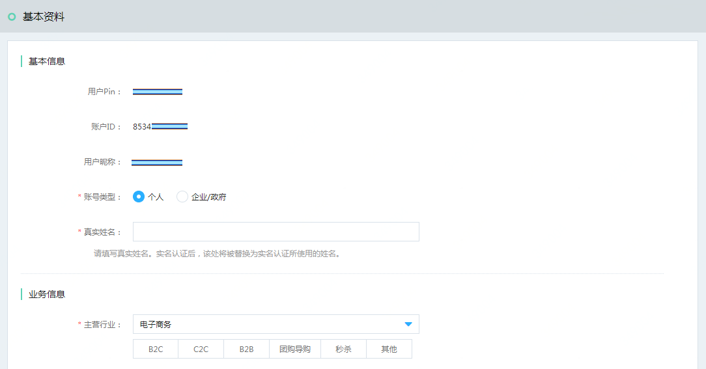
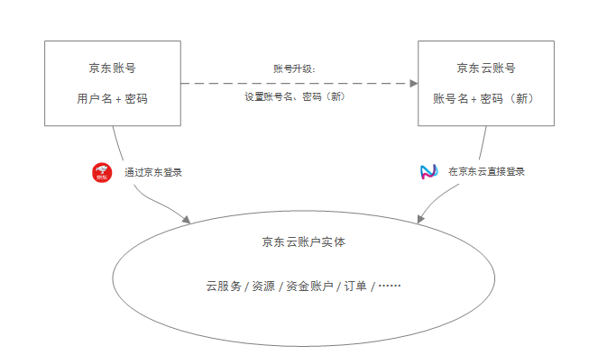
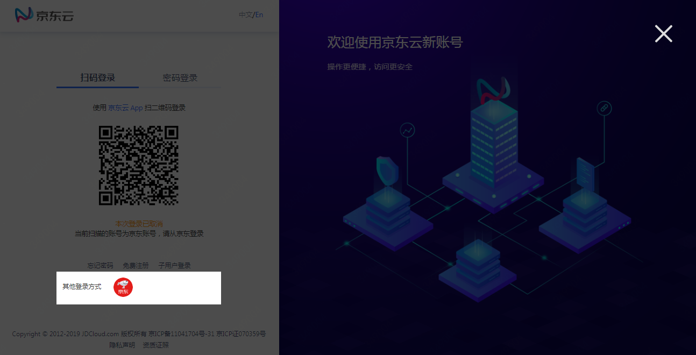
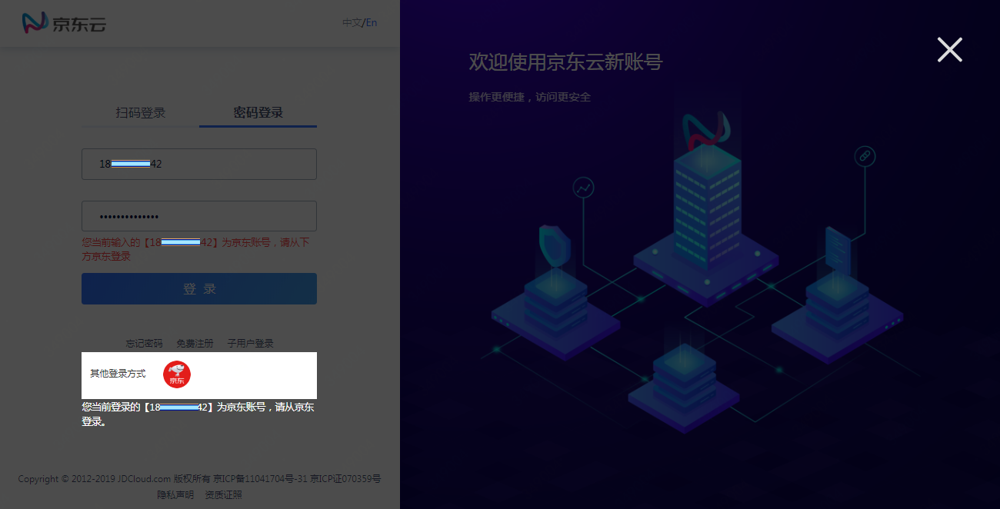
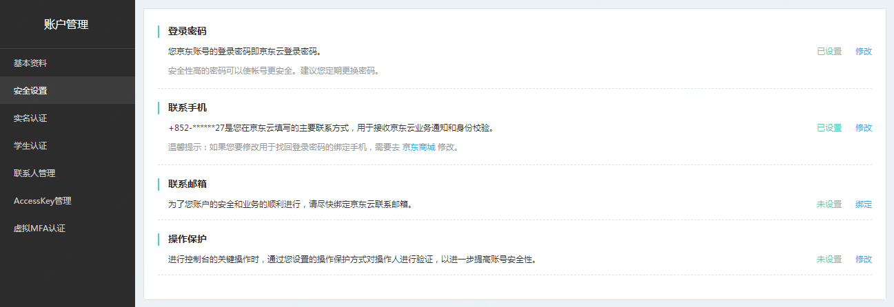
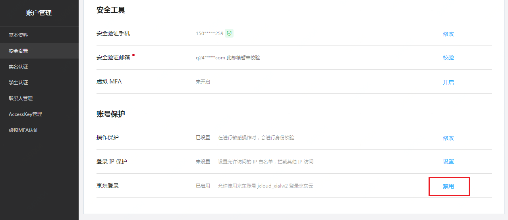
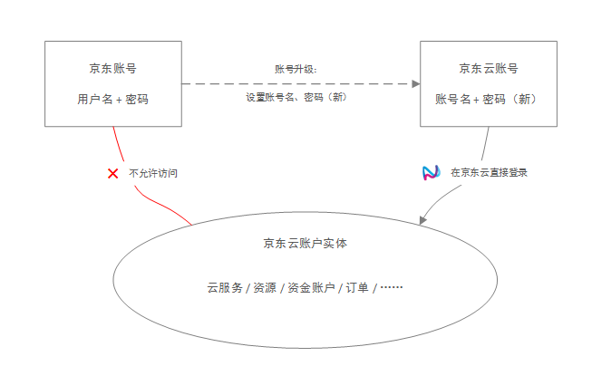

# 京东账号管理

本文将分别介绍如何管理未升级的京东账号和升级后如何禁用京东账号。

## 名词解释
**什么是未升级的京东账号**

京东云的账号系统整体升级，于2019年7月18日起开始支持独立于京东个人业务的云账号，在这之前注册的账号，都属于京东商城的账号系统。如果访问 “[账户管理-基本资料](https://uc.jdcloud.com/account/basic-info)” 时看到如下页面，说明你的账号属于未升级的京东账号：

**什么是京东云账号**

京东云账号是一套全新的账号系统，它有以下特性：
* 独立于京东商城个人业务，对企业用户更友好
* 不受京东商城登录规则限制，支持自定义京东云登录策略
* 账户管理中心升级，操作更便捷

**什么是账号升级**

账号升级指将京东账号升级为京东云独立账号的过程。你可以继续通过京东账号访问京东云，但新的京东云账号更适应云上用户的使用习惯。京东云的绝大多数资源和服务对于京东云账号和京东账号是一致的。但部分账号管理功能不支持未升级的京东账号，包括：
* 不支持设置登录IP保护
* 不支持微信登录

如果你需要使用这些功能，请联系京东云客服升级账号。升级过程中，可以为账号设置新的登录账号名，如不特别指定，账号名将与你的京东账号用户名相同。升级后首次在京东云登录时，你需要通过 “忘记密码” 设置登录密码。
新的账号名与原京东账号的用户名无关，但是它们底层对应着同一个账户实体，因此升级后你的所有京东云服务、云资源不会受影响。升级后京东云账号与京东账号的关系如下图所示：

## 管理未升级的京东账号
### 京东账号登录

京东云支持使用京东账号开通业务。使用京东账号登录时，请在登录页下方选择 “京东登录”。

### 管理手机、邮箱、密码

京东账号的登录手机、登录邮箱、登录密码，请在京东商城修改。修改后，信息不会向京东云同步。

在京东云 “[账户管理 - 安全设置](https://uc.jdcloud.com/account/security-settings)” 页面，你可以管理联系手机和联系邮箱。它们仅在京东云联系你，或向你发送通知时使用。联系手机、联系邮箱可能与你的京东账号登录手机、登录邮箱不同，并且修改后也不会向你的京东账号同步。

### 查看账号信息

你可以在 “[账户管理-基本资料](https://uc.jdcloud.com/account/basic-info)” 页面查看账号信息。其中，用户Pin为京东账号用户名，是京东账号的唯一标识；账户ID由京东云系统生成，部分京东云服务会使用账户ID实现账号间授权，例如访问控制（IAM）。

## 升级后禁用京东账号

完成账号升级后，你就可以直接在京东云登录，而不用再走京东登录。由于京东账号属于个人，当企业员工离职或异动时，企业可能需要禁止其继续访问云控制台。

在 “[账户管理 - 安全设置](https://uc.jdcloud.com/account/security-settings)” 页面，你可以根据需要禁用或重新启用京东账号的访问。

禁用京东登录后，通过京东登录访问控制台时，用户会被强制剔出；同时，不能再通过京东账号登录京东云APP。

