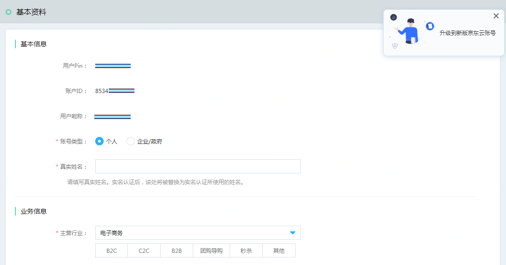
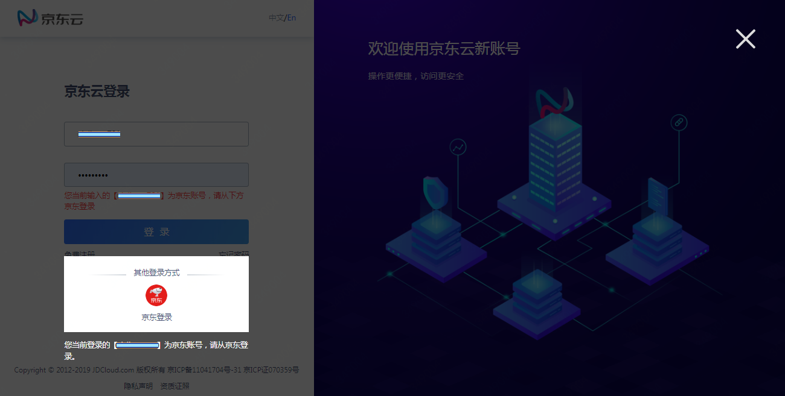

# 京东账号管理

本文将分别介绍 (1)在京东云管理京东账号，(2)将京东账号升级为京东云账号，(3)已升级的账号管理。

## 管理未升级的京东账号
### 什么是未升级的京东账号
如果你是2019年7月18日前开通京东云业务、从未操作过账号升级的老用户，则你的账号属于未升级的京东账号。访问 “[账户管理-基本资料](https://uc.jdcloud.com/account/basic-info)” 页面时，你将看到如下页面：

### 京东账号登录

京东云支持使用京东账号开通业务。使用京东账号登录时，请在登录页下方选择 “京东登录”。

### 管理手机、邮箱、密码

京东账号的登录手机、登录邮箱、登录密码，请在京东商城修改。修改后，信息不会向京东云同步。

在京东云 “[账户管理 - 安全设置](https://uc.jdcloud.com/account/security-settings)” 页面，你可以管理联系手机和联系邮箱。它们仅在京东云联系你，或向你发送通知时使用。联系手机、联系邮箱可能与你的京东账号登录手机、登录邮箱不同，并且修改后也不会向你的京东账号同步。

### 不支持的功能

京东云的绝大多数资源和服务对于京东云账号和京东账号是一致的。但部分账号管理功能不支持未升级的京东账号，包括：
* 不支持设置登录IP保护
* 不支持微信登录
如果你需要使用这些功能，请将账号升级为京东云账号。

## 升级为京东云账号

你可以始终使用京东账号访问京东云，但是不能使用部分京东云的账号管理功能。建议你将账号升级为京东云账号，升级的入口在 “[账户管理-基本资料](https://uc.jdcloud.com/account/basic-info)” 页面。

升级过程中，请设置账号名和密码，该账号名和密码不会同步到京东商城。

## 已升级账号使用京东登录

京东账号完成升级后，
