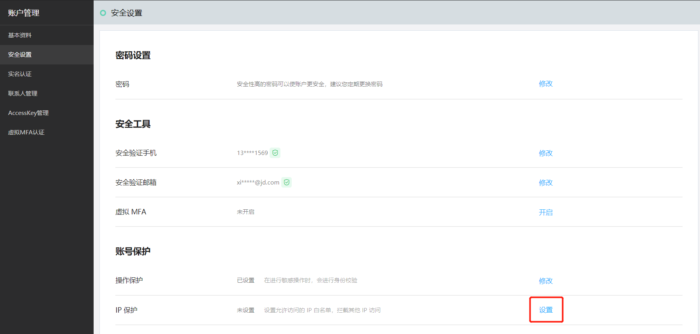
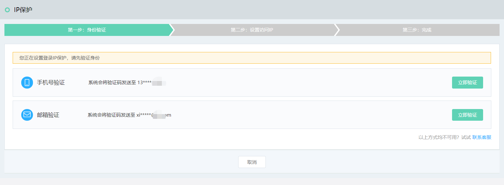
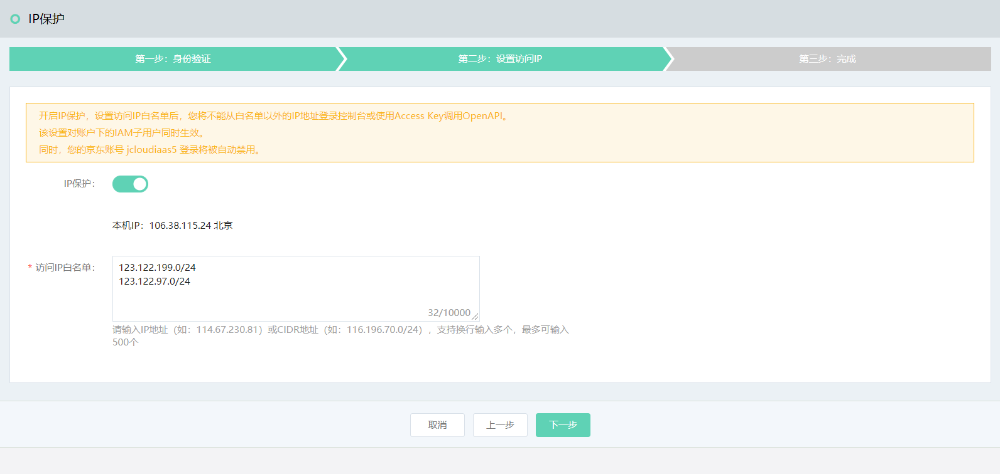
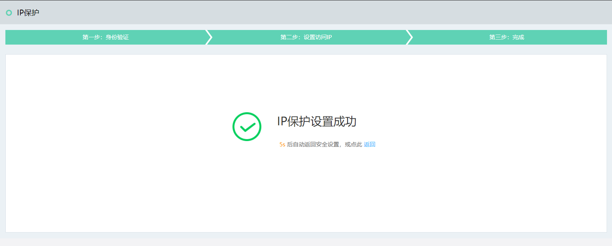
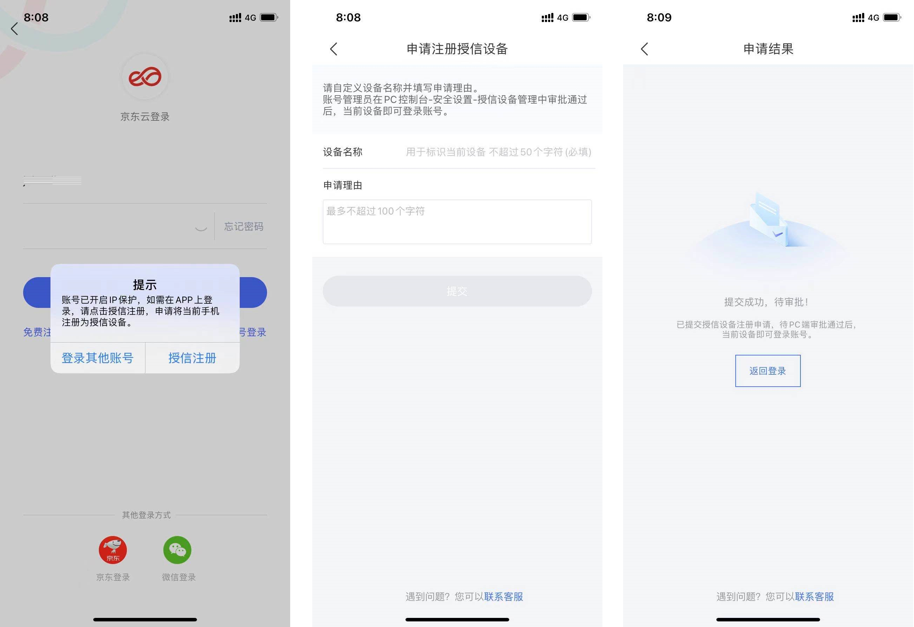
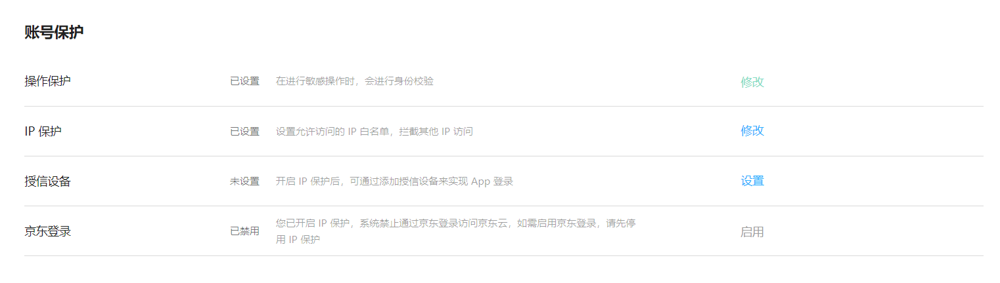
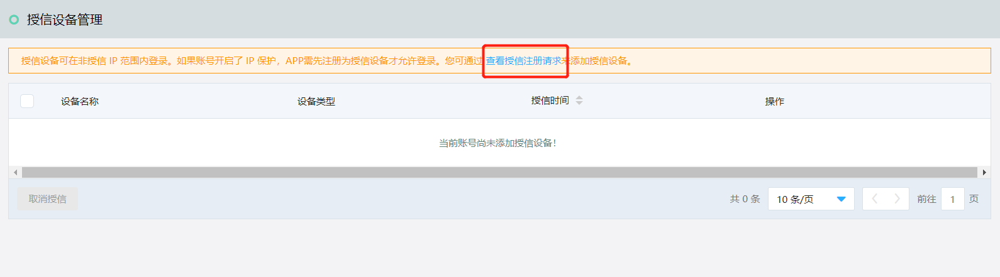
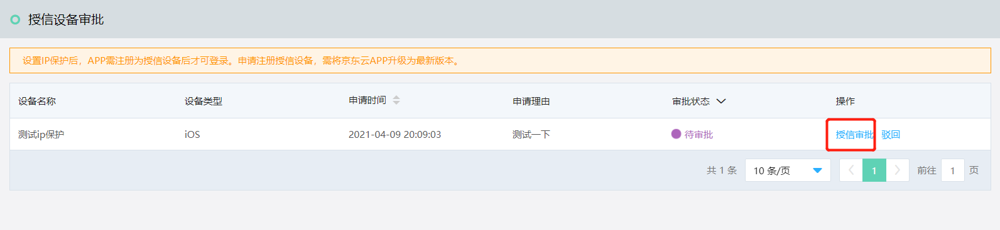
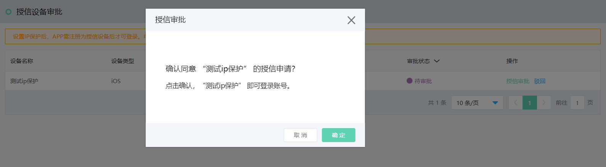

# 设置IP保护
## 什么是IP保护
京东云的账户IP保护，是指为京东云账户的所有访问进行源IP校验。开启并设置IP白名单后，所有的账户访问都会进行IP验证，如果访问IP不在白名单内，则访问会被拒绝，该限制针对以下访问情形：
* 主账号登录控制台；
* 账户下的子用户、角色登录控制台；
* 使用主账号或子用户的Access Key访问OpenAPI

因此，当您配置IP白名单时，请包含可能需要访问控制台的办公网IP和可能需要发起OpenAPI访问的机房、云服务出口IP，并进行充分的测试以验证您的配置正确且完整，以免造成对业务的影响。

另外，一旦开启了IP保护，则无论从任何IP地址发起以下访问，都将被拒绝：
* 登录京东云APP（除非APP设备申请添加为“授信设备”）
* 使用京东账户登录京东云控制台

请注意，一般来说连接VPN不会改变您的访问IP，请和VPN提供商进行确认。

## 设置IP保护的步骤
1. 登录账户管理 - [安全设置](https://uc.jdcloud.com/account/security-settings)，找到IP保护设置项，点击设置

2. 验证操作人的身份

3. 输入允许访问您账户的IP地址（段）列表，最多可以维护500个IP地址（段）

4. 设置成功后立即生效

IP保护设置开启后，如果您的账户可以由京东账号访问，则会同步禁用京东账号登录。请您理解，这是由于目前我们还不能限制京东账号的访问IP。

## 授信设备：IP保护开启时访问京东云APP

如果账户处于IP保护开启状态，而您又必须临时访问京东云APP执行操作，您可以尝试让其他处于IP白名单内、可以登录控制台的主账号管理添加授信设备。

1. 您登录APP时，根据提示完成授信注册

2. 联系能够从IP白名单登录控制台的账户管理员进行授信注册审核，管理员通过主账号登录访问“安全设置”后，点击设置授信设备

3. 查看授信注册请求， 核实授信注册申请后进行审核或驳回

4. 如果设备不再受信任，可通过修改授信设备设置，取消授信

