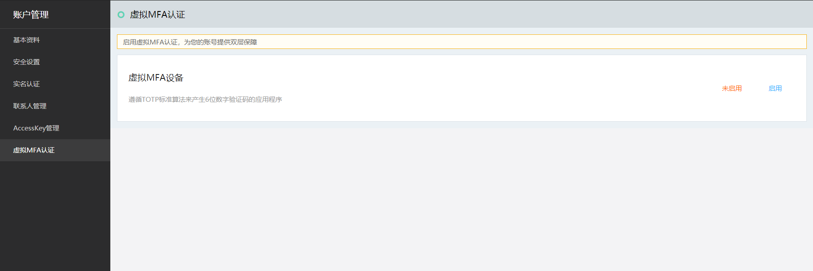
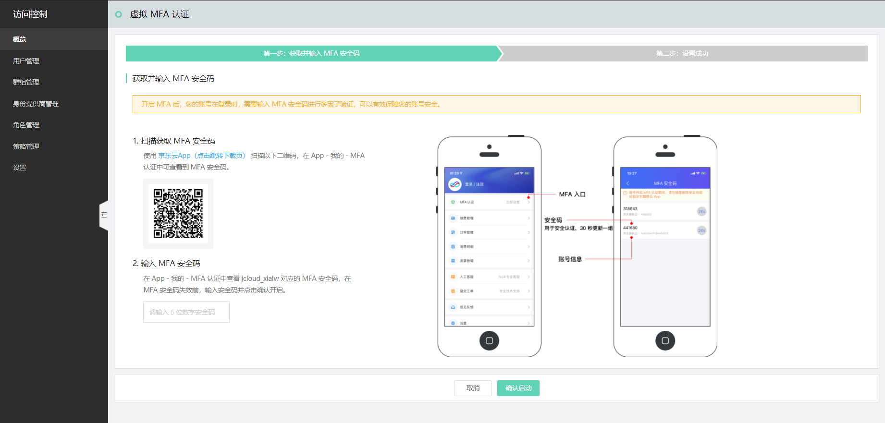
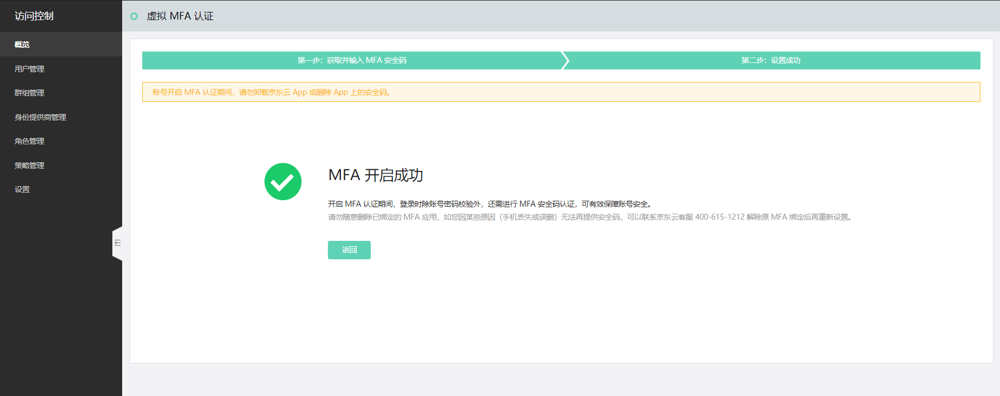
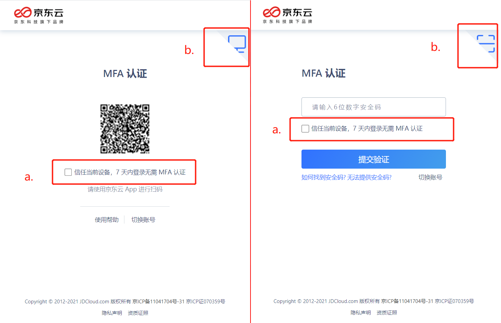

# 设置虚拟 MFA 认证

本文主要介绍如何设置主账号的虚拟 MFA（Multi-Factor Authentication）认证。关于子用户的 MFA 设置，详见：[设置子用户的安全凭证](../../../documentation/Management/IAM/Operation-manual/User-management/setting-user-credentials.md)

## 什么是虚拟 MFA 设备

“虚拟 MFA 设备” 是一个能生成 6 位 TOTP 随机验证码的软件程序，即安装在指定手机上的特定版本的 “京东云 APP” 。启用 MFA 需要您使用京东云 APP 扫码，将该 APP 绑定为虚拟 MFA 设备，后续即可通过该 APP 上生产的验证码进行身份确认。

**请注意，如果绑定后，更换手机重装 APP 或是将 APP 卸载重装，则新的 APP 不再是您绑定的虚拟 MFA 设备，不能再用作身份认证。此时，请联系京东云客服，协助重新绑定虚拟 MFA 设备（即先停用 MFA，再重新绑定启用）。**

## 启用虚拟 MFA 认证

在账户管理-[虚拟 MFA 认证](https://uc.jdcloud.com/account/mfa)页面，可以根据页面提示【启用】虚拟 MFA 设备。

通过启用虚拟 MFA 认证，您可以提升账户的访问安全等级。启用后，您登录控制台时，默认需要进行多因子认证（MFA）。

同时，如果您启用了 MFA，还可以选择在【操作保护】设置中将虚拟 MFA 设备设置为敏感操作的二次身份验证方式。详见：[设置操作保护](../../../documentation/User-Service/Security-Operation-Protection/Operation-Protection.md)

## 登录 MFA 认证

启用虚拟 MFA 认证后，默认登录需要使用绑定的京东云 APP 进行验证。如果您信任当前的设备和浏览器，可以在验证过程中勾选 7 天免验选项（见下图中的 a. 操作）。

京东云支持两种方式的 MFA 认证：扫码认证或者输入安全码认证（见下图中的 b. 操作）

- 扫码认证：打开京东云 APP，直接点击左上角 “扫一扫”，扫描屏幕二维码后确认登录即可；
- 安全码认证：打开京东云 APP，访问 “控制台” 页面（在 APP 左下方），选择 “MFA认证”（在控制台页面 “常用云产品” 的右上方），并在 MFA 安全码页面找到您的子用户账号（每一个安全码下方，都标注了对应的京东云账号）对应的安全码进行填写。

