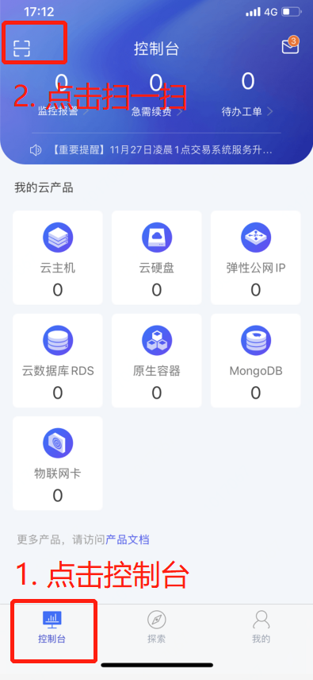
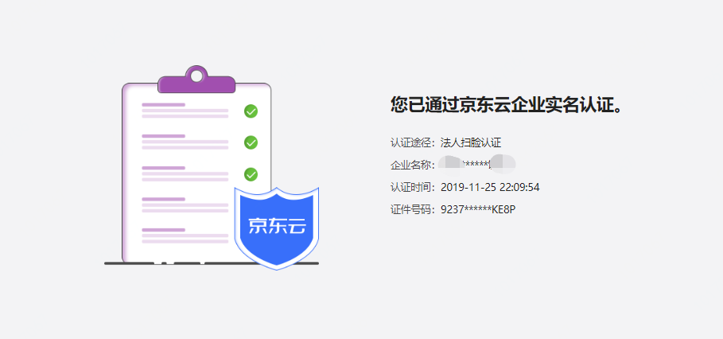

# 法人扫脸认证

[京东云企业认证](https://realname.jdcloud.com/account/verify)支持企业法人扫脸认证。针对个体工商户，也可以采取企业法人扫脸的认证方式。
同时，如果您的账号已经在[京东金融企业站](https://biz.jd.com)完成了企业实名认证，您也可以在京东云页面完成认证状态的一键同步。

## 认证步骤

法人扫脸认证流程主要分为以下四个步骤：

 1. 选择企业实名方式 - 法人扫脸实名
 2. 填写企业名称、法人姓名和法人身份证号，核对无误后提交
 3. 上述三项信息校验无误后，会实时生成二维码
 4. 法人本人使用京东云APP扫描二维码并完成扫脸操作

注：按照国务院登记制度改革意见及各省市加快推进“五证合一、一照一码”登记制度改革的相关要求，各类市场主体需在2017年12月31日之前，完成“统一社会信用代码”营业执照换发工作。2018年1月1日起，未换发的证照将失去效用，市场主体将变成无证经营。因此，京东云当前仅支持用户使用加载了统一社会信用代码的营业执照完成企业实名认证。

**1. 选择主体类型**

进入[实名认证](https://realname.jdcloud.com/account/verify)页面，选择企业认证。

- 有限责任公司，请选择企业；
- 个体工商户，请选择个体工商户。

**2. 选择认证方式**

选择法人扫脸认证，点击“下一步”。

**3. 填写企业名称和法人信息**

请输入您营业执照上的单位名称、法人姓名和法人身份证号。

**4. 点击”下一步“，生成二维码**

点击“下一步”，生成包含法人身份信息的二维码。

**5. 使用京东云 App 扫描二维码**

下载[京东云 App](https://console.jdcloud.com/download)，使用 App 的控制台左上角的“扫一扫”功能扫描二维码

**6. 在 App 上完成扫脸**

**7. 扫脸校验通过，即完成了企业实名认证**

扫脸认证通过，即完成了企业实名认证，可在 PC 页面查询您的实名详情。

