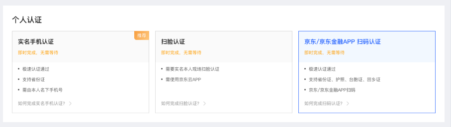
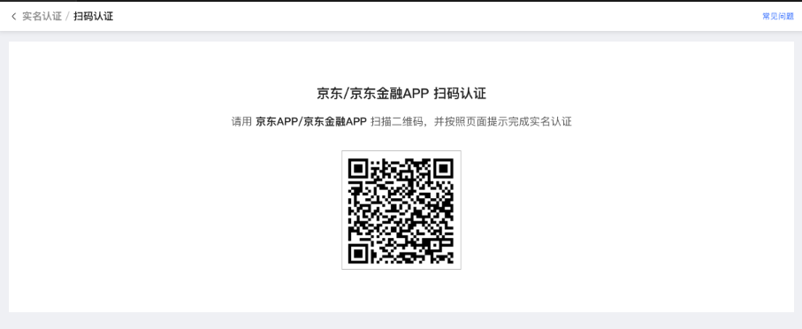
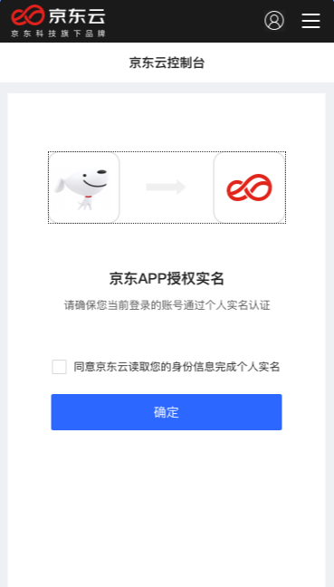
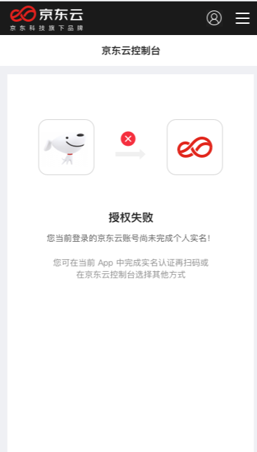
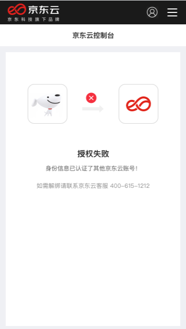

# 京东/京东金融APP扫码认证

[京东云个人认证](https://realname.jdcloud.com/account/verify)存在基于京东的用户群体，支持用户使用京东/京东金融APP扫码授权实名，拓展快捷且安全的个人实名认证的方式。

## 名词解释

京东/京东金融APP扫码认证指您使用本人京东APP进行扫码，经过京东/京东金融APP授权实名完成京东云个人实名认证。

## 认证流程

1. 进入实名认证页面，在”个人认证”选项卡里点击“京东/京东金融APP扫码认证”，系统生成二维码，用户使用京东/京东金融APP进行扫码。

2.	用户使用京东/京东金融APP扫描二维码，如果系统检测到您的账号已经在京东商城/京东金融完成了个人实名认证，页面跳转授权页面，勾选”同意京东云读取您的身份信息完成个人实名”协议，点击“确定”完成京APP授权实名，授权京东云获取您在京东商城/京东金融的实名信息。

3.	用户使用京东/京东金融APP扫描二维码，如果系统检测到您的账号已经在京东商城/京东金融未完成个人实名，页面跳转页面，提示用户授权失败，并告知原因”您当前登录的京东云账号尚未完成个人实名”。

4.	用户使用京东/京东金融APP扫描二维码，如果系统检测到您的账号已经认证了其他京东云账号，页面跳转页面，提示用户授权失败，并告知原因” 您的账号已经认证了其他京东云账号”。

