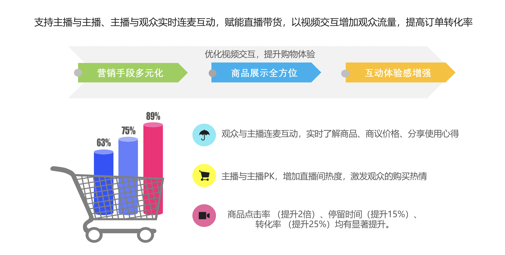
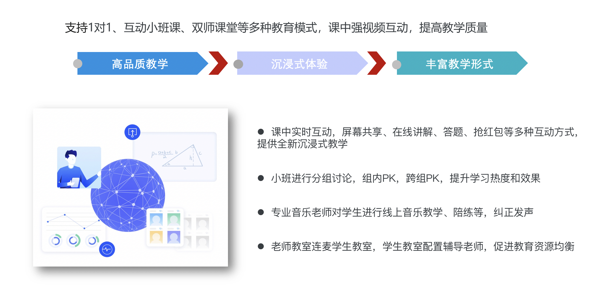
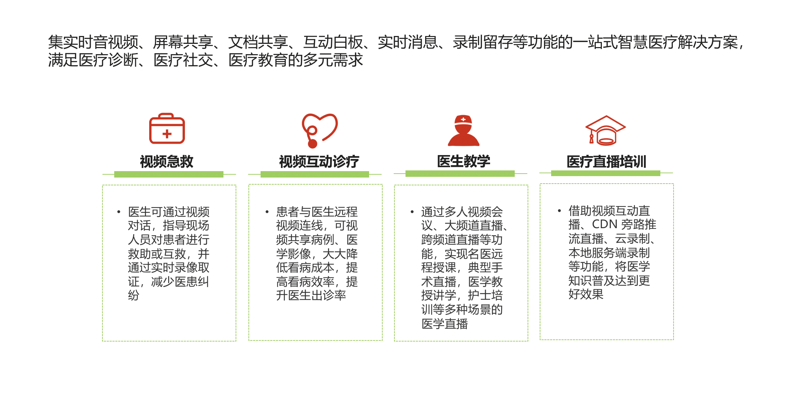

# 应用场景

JRTC提供低延迟、高可、靠易接入的音视频通信平台，适用于各类对延迟和稳定性、交互性有要求的业务。  

详细举例如下：  

-   **视频电商**

支持主播与主播、主播与观众实时连麦互动，赋能直播带货，以视频交互增加观众流量，提高订单转化率

-   **在线教育**

支持1对1、互动小班课、双师课堂等多种教育模式，课中强视频互动，提高教学质量

-   **互联网医疗**

集实时音视频、屏幕共享、文档共享、互动白板、实时消息、录制留存等功能的一站式智慧医疗解决方案，满足医疗诊断、医疗社交、医疗教育的多元需求

