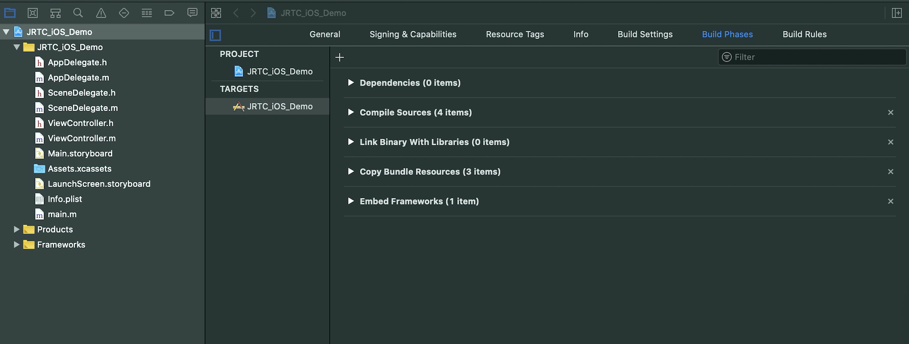
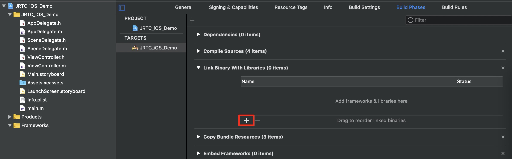
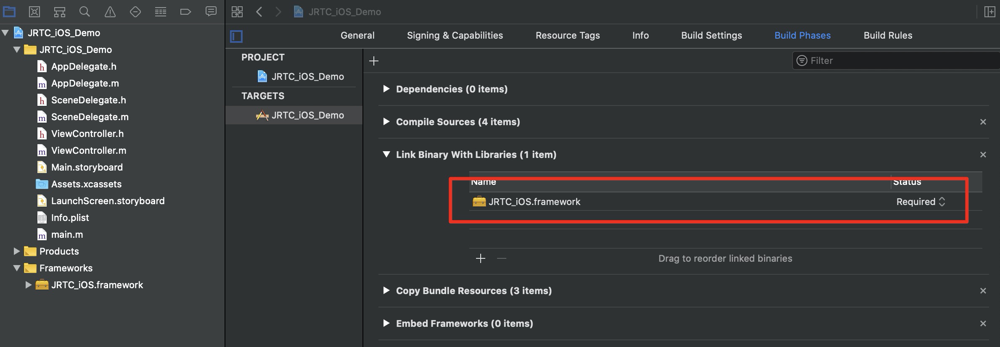
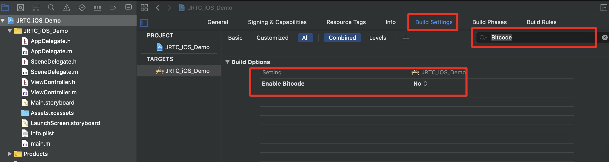
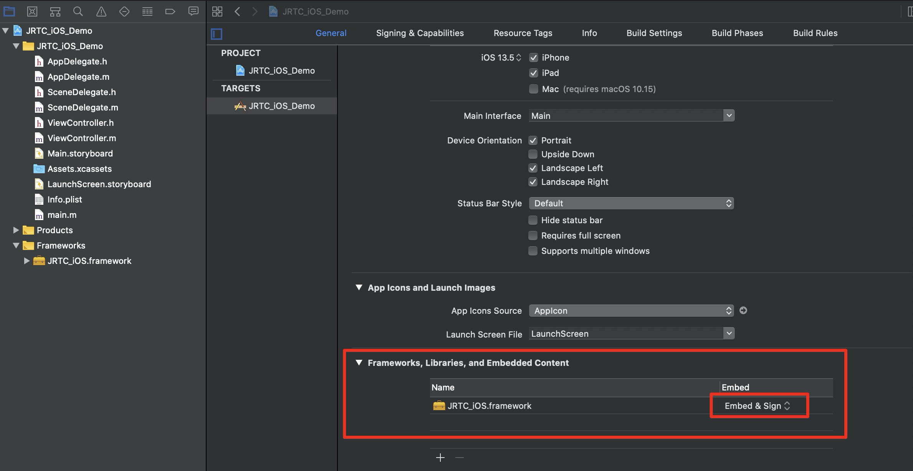
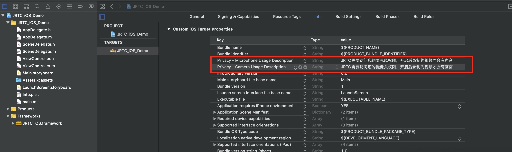

# 快速集成（iOS）

本文主要介绍如何快速地将京东云 JRTC_iOS SDK（iOS）集成到您的项目中，只要按照如下步骤进行配置，就可以完成 SDK 的集成工作。

开发环境要求

Xcode 9.0+。

iOS 8.0 以上的 iPhone 真机。

项目已配置有效的开发者签名。

# 手动集成 JRTC_iOS SDK 

JRTC_iOS SDK 当前只支持手动集成到您的项目中。您可以在京东云官网下载 SDK 再将其导入到您当前的工程项目中。

1. 下载 JRTC_iOS SDK ，下载完成后，进行解压。

2. 打开您的Xcode工程项目，选择要运行的target,选中 Build Phases项

3. 单击 Link Binary with Libraries 项展开，单击底下的“+”号图标去添加依赖库。

4. 添加所下载的 JRTC_iOS SDK Framework。

# 设置Xcode Enable Bitcode 为 NO

打开您的Xcode工程项目，选择要运行的target,选中 Build Settings项，搜索Bitcode，将Enable Bitcode选项设置为NO。

# 设置JRTC_iOS SDK Embed 为 Embed & Sign

打开您的Xcode工程项目，选择要运行的target,选中 General项，点击Frameworks,Libraries,and Embedded Content项展开， 选中JRTC_iOS.framework,将Embed 设置为 Embed & Sign。

# 授权摄像头和麦克风使用权限

使用 SDK 的音视频功能，需要授权麦克风和摄像头的使用权限。在 App 的 Info.plist 中添加以下两项，分别对应麦克风和摄像头在系统弹出授权对话框时的提示信息。

Privacy - Microphone Usage Description，并填入麦克风使用目的提示语。

Privacy - Camera Usage Description，并填入摄像头使用目的提示语。

# 引用 JRTC_iOS SDK

Objective-C 通过  `#import "JRTC_iOS/JRTC_iOS.h"` 引用 JRTC_iOS SDK

# 常见问题

1. JRTC_iOS SDK 是否支持后台运行？
支持，如需要进入后台仍然运行相关功能，可选中当前工程项目，在 Capabilities 下的设置 Background Modes 打开为 ON，并勾选 Audio，AirPlay and Picture in Picture和Voice over IP ，如下图所示：

